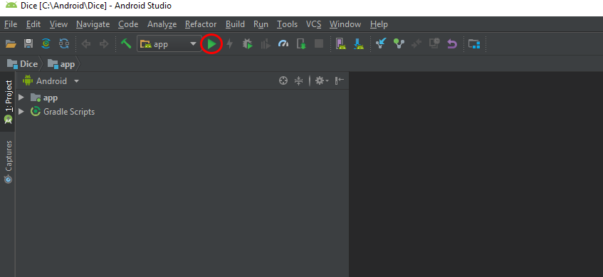

# Android Studio


Voir également : [installation Android Studio](./installation_android_studio.md)

## Environnement de développement

Android studio fournis des outils pour vous aider à développer, les plus importants étant :
* les SDK : ils sont chacun associés à une version d'Android minimale, c'est un ensemble d'outils et d'API qui vous permettent d’utiliser le téléphone portable et les outils Google ;
* Gradle : cet outil permet de gérer les dépendances de votre projet, d'en assurer la compilation, etc ;
* Logcat : gestion des logs.

## Émulation d'un téléphone

Afin de pouvoir aisément tester votre application, vous pouvez utiliser l'émulateur de téléphone (l'avantage par rapport l'utilisation d'un véritable smartphone est que vous pouvez envoyer des positions GPS facilement pour simuler l'utilisation de l'application mais également tester simplement d'autres versions d'Android).

Vous pouvez gérer téléphones *émulés* via le bouton `AVD Manager` :


Au lancement de votre application, Android Studio vous proposera de choisir le téléphone à utiliser.

## Gestion des SDK

Au premier démarrage d'Android Studio, nous avons téléchargé la dernière version du SDK Android et la version 24. Vous pouvez télécharger d'autres versions en ouvrant le `SDK Manager` :


(C'est en fait un raccourci vers [les options de configurations Android Studio](./installation_android_studio.md#configuration-avancée) déjà utilisées.)

Il n'y a pas que les SDK principaux, mais également d'autres outils (comme par exemple les Google Services qui permettent notamment de faire des cartes).

## Gradle

Gradle gère les dépendances et la compilation de votre projet. Gradle effectue régulièrement des synchronisations il faut attendre qu'elles soient terminées pour modifier votre code (notamment au début).

Vous pouvez resynchroniser Gradle en cliquant sur le bouton (la position du bouton peut changer) :


Le fichier de configuration principal de Gradle pour votre application est `Gradle Scripts/build.gradle (Module: app)`. Exemple de fichier :

```js
apply plugin: 'com.android.application'

android {
    compileSdkVersion 27
    defaultConfig {
        applicationId "fr.ign.vsasyan.twosidesofthecoin"
        minSdkVersion 15
        targetSdkVersion 27
        versionCode 1
        versionName "1.0"
        testInstrumentationRunner "android.support.test.runner.AndroidJUnitRunner"
    }
    buildTypes {
        release {
            minifyEnabled false
            proguardFiles getDefaultProguardFile('proguard-android.txt'), 'proguard-rules.pro'
        }
    }
}

dependencies {
    implementation fileTree(dir: 'libs', include: ['*.jar'])
    implementation 'com.android.support:appcompat-v7:27.1.1'
    implementation 'com.android.support.constraint:constraint-layout:1.1.3'
    testImplementation 'junit:junit:4.12'
    androidTestImplementation 'com.android.support.test:runner:1.0.2'
    androidTestImplementation 'com.android.support.test.espresso:espresso-core:3.0.2'
}
```

Vous pouvez voir :
* les SDK d'Android ciblé par votre application ;
* les dépendances.

Le panneau de gauche vous donnant la liste des fichiers composant votre application ne donne d'ailleurs pas la véritable structure des fichiers. C'est Gradle qui gère cela. (Donc si le panneau de gauche n'a pas la structure habituelle, cela est généralement dû à un problème de Gradle.)

Exemple du panneau de gauche VS la véritable structure des données :


## Compilation et lancement

Pour compiler votre projet, cliquez sur le bouton `Make Project` (Ctrl + F9) :


Cela permet de vérifier que tout est bon : pas d'erreur Java, les dépendances sont chargées, etc.

Pour lancer votre projet, cliquez sur le bouton `Run 'app'` (Maj + F10) :



Android Studio va alors vous demander de choisir où lancer votre application :
* sur un téléphone connecté à l'ordinateur ;
* sur un téléphone émulé.


