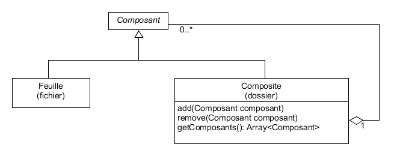

# Les Principaux Patrons de Conception (*Design Pattern*)

## Liste des Patrons de Conception

* MVC : Modèle Vue Contrôleur
* DAO : Data Access Object (Object d'Accès aux Données)
* Composite
* Decorator (Décorateur)
* Observer (Observateur)

## MVC : Modèle Vue Contrôleur

Séparations en 3 modules :

* Modèle : classes de gestion des données (validation, lecture, enregistrement) ;
* Vue : gestion de l'interface graphique (elements graphique et représentation de la donnée) ;
* Contrôleur : traitement des actions utilisateur (agit sur le modèle et la vue).

En Android :

* Modèle : classe métier, Service, ...
* Vue : fichiers XML détaillant les éléments graphique ;
* Contrôleur : les classes Java associées aux activités.

## DAO : Data Access Object

L'objectif de se patron de conception est de rendre les classes de gestion de donnée métier indépendante de la manière dont les données sont stockées.

Les classe DAO vont donc faire le lien entre la couche métier et la couche persistante.

## Composite

L'objectif de ce patron de conception est de simplifier la gestion des structures arborescentes : on utilise une interface pour manipuler les feuilles et le composite de la même manière.

Pour exemple, voici la représentation d'une arborescence de dossiers et de fichiers :



L'ajout d'un fichier ou d'un dossier à un dossier se fait de la même manière : ces deux objets implémentent la même interface logicielle.

## Decorator (Décorateur)

Le décorateur permet d'attacher dynamiquement de nouvelles responsabilités à un objet (ce qui est plus souple qu'un héritage).

En Android, cela est notamment utilisé lors de la création d'écouteurs d'événement et de callbacks :

```java
View.OnClickListener listener = new View.OnClickListener() {
    @Override
    public void onClick(View v) {
        // Here we do some stuff...
    }
};
```

Dans l'exemple précédent, la classe `View.OnClickListener` est *décorée* : on modifie dynamiquement la fonction `onClick`.

## Observer (Observateur)

Ce patron de conception permet de simplifier la gestion des événements : un élément *observable* pourra, lors ce qu'une action se produit, notifier les éléments *observateurs* qui lui sont associés.

Il est utilisé en Android pour la gestion des événements (`onClick`, ...) et des callbacks (`onMapReady`, ...).
