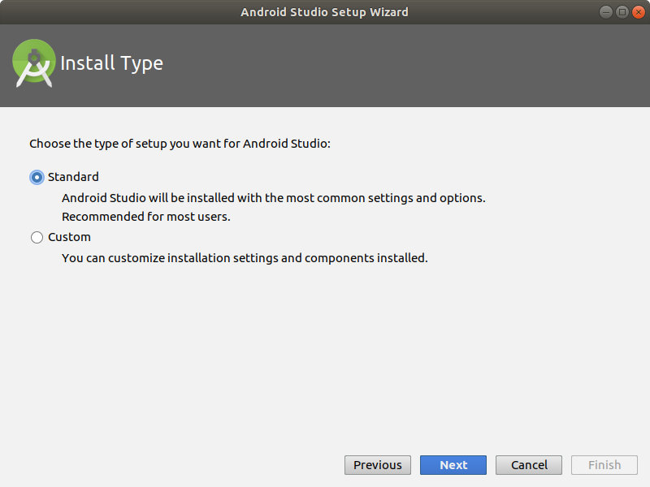

# Installation d'Android Studio

## Téléchargement

https://developer.android.com/studio/#downloads

## Installation de Java Developpment Kit (JDK)

Android Studio a besoin du Kit de Développement Java pour fonctionner.

### Installation sur Ubuntu

Installez simplement la version 8 d'`openjdk` via `apt` :

```sh
sudo apt update && sudo apt install openjdk-8-jdk -y
```

### Windows/Mac

Téléchargez l'installateur :

https://www.oracle.com/technetwork/java/javase/downloads/jdk8-downloads-2133151.html


## Installation d'Android Studio

https://developer.android.com/studio/install

### Sur Ubuntu

Guide : https://developer.android.com/studio/install#linux

Ou, plus simplement, via `snap` en lançant dans un terminal :

```sh
sudo snap install android-studio --classic
```

### Sur Windows/Mac

Suivez le guide [Windows](https://developer.android.com/studio/install#windows) ou [Mac](https://developer.android.com/studio/install#mac) (rien de bien compliqué).

## Configuration d'Android Studio

### Premier démarrage d'Android Studio

Android Studio vous demande si vous souhaitez importer des préférences : sautez cette étape.

Puis Android Studio vous aide à configurer le SDK utilisé :


1. Choisissez la configuration standard :



2. Choisissez le thème de couleur de votre choix ;

3. Au moment du *choix* du Kit de Développement Android, pensez à cocher bien cocher "Android Virtual Device" (pour pouvoir émuler un téléphone si besoin) :


4. Suivez les étapes suivantes jusqu'à la fin...

5. Android Studio doit démarrer !

### Configuration avancée

Avant de créer un premier projet, nous allons configurer un peu plus Android studio :

1. Configure => Android SDK :


2. dans l'onglet "SDK Tools" cochez Google Play services :


3. Cliquez sur "HTTP Proxy" à gauche (ou tapez "proxy" dans la barre de recherche en haut) : choisissez "**Manuel proxy configuration**", host `http://proxy.ensg.eu`, port "**3128**" :


4. Cliquez sur OK et confirmez.


### Ajout d'un lanceur

Selon la méthode d'installation choisie, vous pouvez ajouter un lanceur (pour ne plus avoir à lancer Android Studio en ligne de commande) en faisant : `Tools` => `Create Desktop Entry...` :


