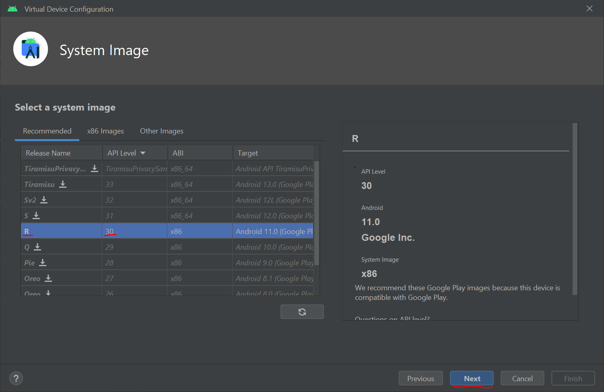

# Utiliser les émulateurs

Pour tester facilement votre application, le plus simple est d'utiliser un émulateur. Ce service est fourni par Android Studio.

Ouvrez le *Device Manager* :

* via l'icône dans la barre d'outils :

* via le volet *Device Manager* à droite :

## Création d'un appareil

Cliquez sur le bouton *Create device* :

Choisissez alors un téléphone ayant le Play Store, par exemple le Pixel 2, et cliquez sur *Next* :

Choisissez une image système (c'est à dire la version d'Android à installer), par exemple la *R - API level 30* :

**Si l'image que vous choisissez n'est pas déjà téléchargée, il faudra en premier lieu la télécharger en appuyant sur l'icône :**

Modifiez le nom de l'appareil si besoin, puis terminez la création :

## Lancement de l'appareil

Votre appareil sera alors ajouté à la liste, cliquez sur la flèche pour le lancer :

Votre appareil est prêt à recevoir une application !

## Fonctionnalités de l'émulateur

En cliquant sur l'icône `⋮` *Extended Controls*, vous pouvez afficher des outils pour simuler plein de choses :
* la position de votre appareil ;
* l'orientation du téléphone ;
* etc.

