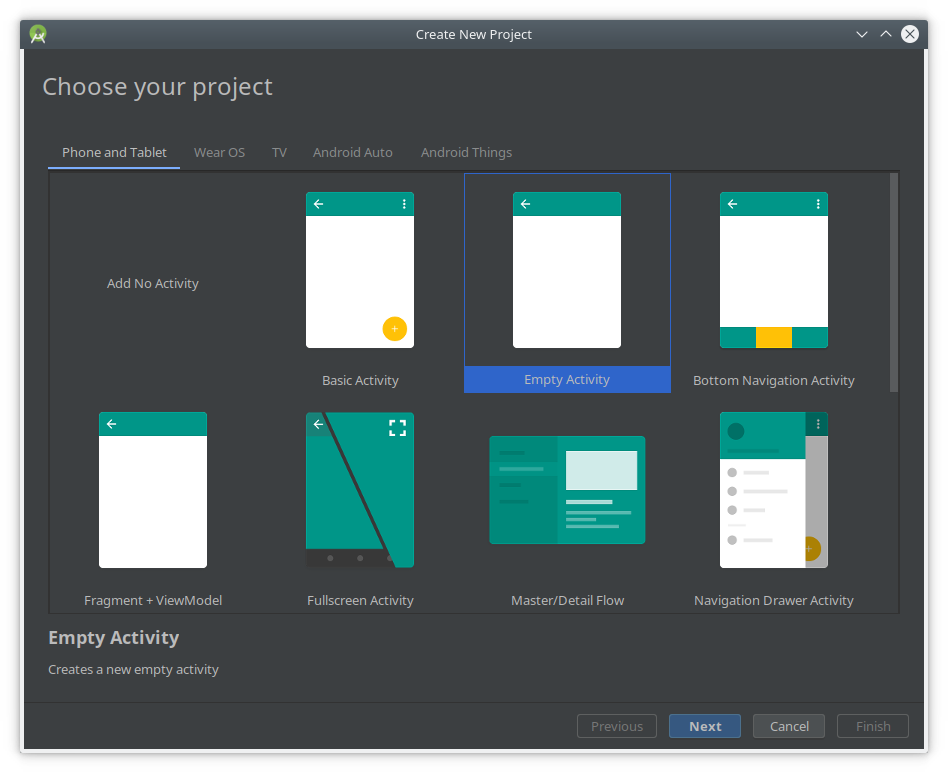
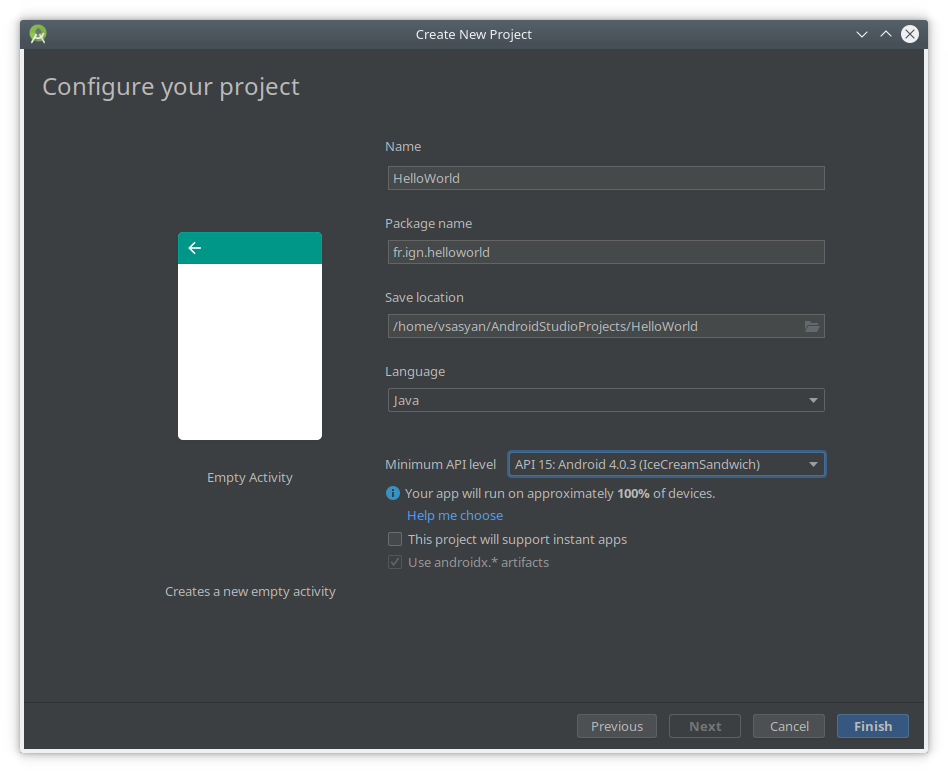
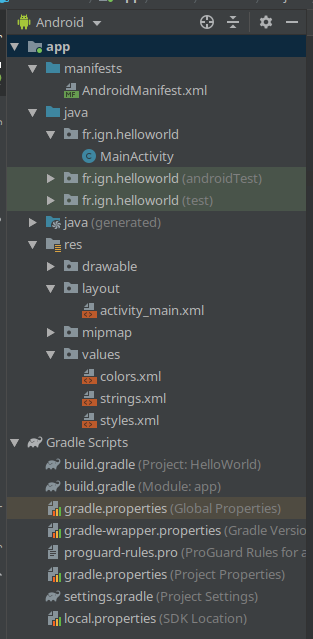
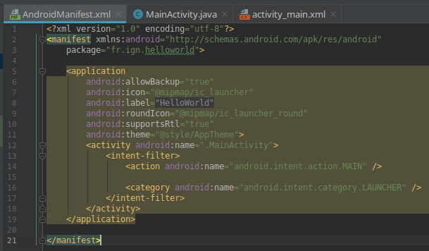
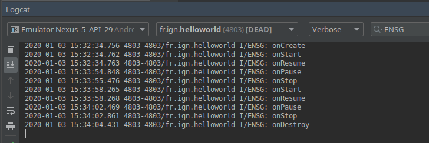

# Une première application

Pour mettre en pratique l'utilisation d'Android Studio et prendre
en main un projet Android, nous allons créer une application simulant
un lancer de pièce (pile ou face).

## Objectif

L'objectif de cette partie est de voir le fonctionnement des activités.

## Le principe de l'application

L'application sera composée d'une vue permettant d'afficher un texte (`TextView`).

## Mise en place

Créez un nouveau projet :

1. Choisissez une activité vide `EmptyActivity` :



2. Configurez votre projet :
   1. appelez-le `HelloWorld` ;
   2. choisissez un nom de package (par exemple `fr.ign.helloworld`) ;
   3. sélectionnez le language Java ;
   4. sélectionnez l'API 15.



Regardez la structure du projet créé par Android Studio :



Ouvrez les fichiers `manifests/AndroidManifest.xml`, `java/MainActivity`, et `res/layout/activity_main.xml` (en mode Design et Text) :




Vous pouvez lancer l'application.


## Les activités

Dans cette première application, une activité a automatiquement été créée avec le projet.

Les activité permettent de gérer l'interface utilisateur. On crée une activité pour chaque tâche que l'utilisateur peur faire dans notre application.

C'est donc l'équivalent d'une fenêtre d'un programme ou d'une page d'un site web.

### La classe `Activity`

La classe [activité](https://developer.android.com/reference/android/app/Activity) permet de gérer l'interface graphique mais elle contient également le [Context](https://developer.android.com/reference/android/content/Context) de l'application.

C'est le context qui permet de lier l'application (et les différentes activités que la composent) au système Android.

### Cycle de vie de l'activité

Les applications android sont pensées pour être particulièrement dynamiques : votre application doit être capable de réagir si, par exemple, vous recevez un appel ou démarrez une autre application.

Dans ce cas l'état de votre activité est modifié et certaines fonctions spécifiques sont appelées :


Il y a 4 états principaux :

* `active` ou `running` : l'activité est au premier plan ;
* `visible` : l'activité a perdu le focus mais est toujours visible (multi-fenêtre, pop-up devant, ...) ;
* `stopped` ou `hidden` : l'activité est complètement masquée, le système peut la terminer (ou la tuer) s'il a besoin de mémoire ;
* `destroyed` : le système a fermé l'activité, il faut la recharger entièrement pour l'afficher de nouveau.

Le schéma présente les différents état ainsi que les fonctions exécuté au passage de l'un à l'autre (ces fonctions ne sont pas nécessairement exécutées quand l'activité est « tuée » et non pas « terminée »).

Implémentez ces fonctions et utilisez les logs pour suivre leur executions.

Vous pouvez facilement ajouter des fonctions à réécrire en utilisant les touches `<Ctrl>` + `<O>`. Sélectionnez alors les fonctions `onStart`, `onStop` et `onDestroy` héritant de `androix.appcompat.pp.AppCombatActivity` et les fonctions `onPause` et `onResume` héritant de `androix.fragment.app.FragmentActivity`.

Voici par exemple le code pouvant être obtenu.

```java
public class MainActivity extends AppCompatActivity {

    @Override
    protected void onCreate(Bundle savedInstanceState) {
        super.onCreate(savedInstanceState);
        setContentView(R.layout.activity_main);
        Log.i("ENSG", "onCreate");
    }

    @Override
    protected void onStart() {
        super.onStart();
        Log.i("ENSG", "onStart");
    }

    @Override
    protected void onStop() {
        super.onStop();
        Log.i("ENSG", "onStop");
    }

    @Override
    protected void onDestroy() {
        super.onDestroy();
        Log.i("ENSG", "onDestroy");
    }

    @Override
    protected void onPause() {
        super.onPause();
        Log.i("ENSG", "onPause");
    }

    @Override
    protected void onResume() {
        super.onResume();
        Log.i("ENSG", "onResume");
    }
}
```

Vous pouvez alors lancer l'application en allant dans l'onglet **Logcat** et en entrant « ENSG » (ou le tag que vous avez utilisé) dans le filtre. Quittez et ré-ouvrez l'application avant de la fermer via le gestionnaire. Regardez les logs :




### La fonction `onCreate`

```java
    @Override
    protected void onCreate(Bundle savedInstanceState) {
        super.onCreate(savedInstanceState);
        setContentView(R.layout.activity_main);
    }
```

Cette fonction permet d'initialiser la vue liée à votre activité :
* la fonction `setContentView` permet de définir le contenu de l'interface ;
* `R.layout.activity_main` est l'identifiant lié au fichier de ressource `res/layout/activity_main.xml` définissant l'interface.
*

## Les points à retenir

L'interface est gérée par les activités. Une activité est une « page » de votre application.

Les activités ont un état : active, visible, arrêtée/cachée ou détruite.

Au changement d'état, des fonctions sont appelées via le système Android : à vous d'effectuer les bonnes actions pour que votre activité réagisse correctement.
