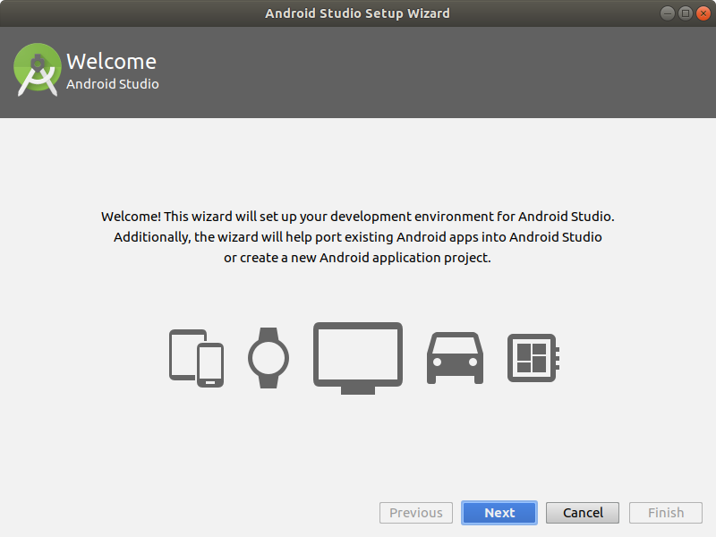
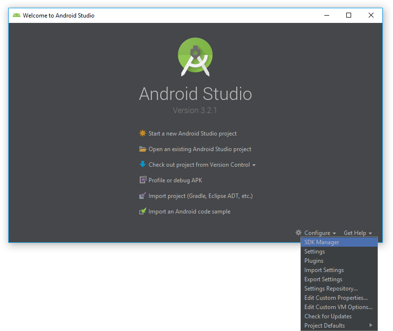

# Installation d'Android Studio

## Téléchargement

https://developer.android.com/studio/#downloads

## Installation de Java Developpment Kit (JDK)

Android Studio a besoin du Kit de Développement Java pour fonctionner.

### Installation sur Ubuntu

Installez simplement la version 8 d'`openjdk` via `apt` :

```sh
sudo apt update && sudo apt install openjdk-8-jdk -y
```

### Windows/Mac

Téléchargez l'installateur :

https://www.oracle.com/technetwork/java/javase/downloads/jdk8-downloads-2133151.html


## Installation d'Android Studio

https://developer.android.com/studio/install

### Sur Ubuntu

Guide : https://developer.android.com/studio/install#linux

Ouvrez un terminal et entrez les commandes :

1. Création d'un dossier d'installation : `mkdir bin`
2. Déplacement du fichier zip dans le dossier : `mv Téléchargements/android-studio-ide-181.5056338-linux.zip bin` (le nom du fichier sera sûrement différent...)
3. On passe dans le dossier d'installation : `cd bin`
4. Extraction du zip : `unzip android-studio-ide-181.5056338-linux.zip`
6. Installation des programmes nécessaires : `sudo apt update && sudo apt install libc6:i386 libncurses5:i386 libstdc++6:i386 lib32z1 libbz2-1.0:i386 -y`
5. On passe dans le dossier `bin` : `cd android-studio/bin`
6. Lancement d'android studio : `./studio.sh`

### Sur Windows/Mac

Suivez le guide [Windows](https://developer.android.com/studio/install#windows) ou [Mac](https://developer.android.com/studio/install#mac) (rien de bien compliqué).

## Configuration d'Android Studio

### Premier démarrage d'Android Studio

Android Studio vous demande si vous souhaitez importer des préférences : sautez cette étape.

Puis Android Studio vous aide à configurer le SDK utilisé :



1. Choisissez la configuration standard :


2. Choisissez le thème de couleur de votre choix ;

3. Au moment du *choix* du Kit de Développement Android, pensez à cocher bien cocher "Android Virtual Device" (pour pouvoir émuler un téléphone si besoin) :


4. Suivez les étapes suivantes jusqu'à la fin...

5. Android Studio doit démarrer !

### Configuration avancée

Avant de créer un premier projet, nous allons configurer un peu plus Android studio :

1. Configure => Android SDK :



2. dans l'onglet "SDK Tools" cochez Google Play services :


3. Cliquez sur "HTTP Proxy" à gauche (ou tapez "proxy" dans la barre de recherche en haut) : choisissez "**Manuel proxy configuration**", host `http://proxy.ensg.eu`, port "**3128**" :


4. Cliquez sur OK et confirmez.
