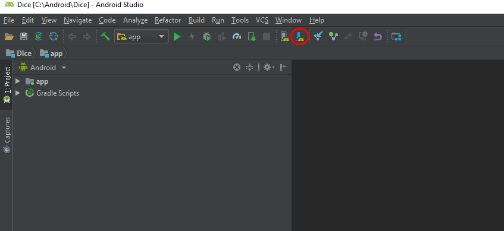
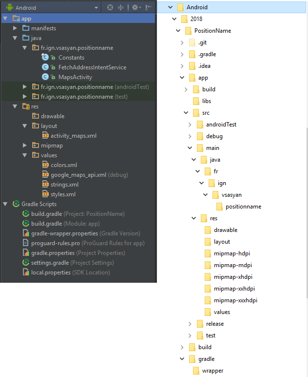
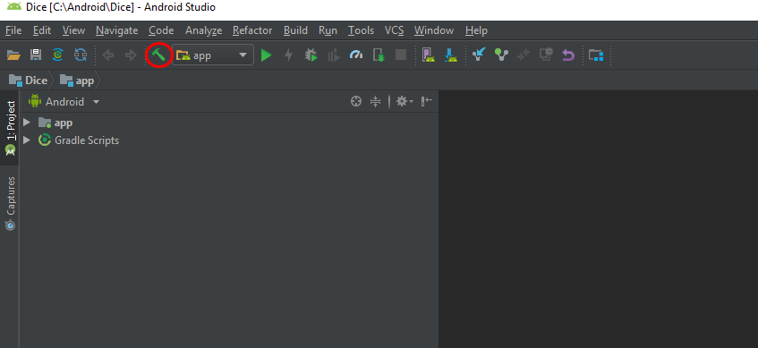
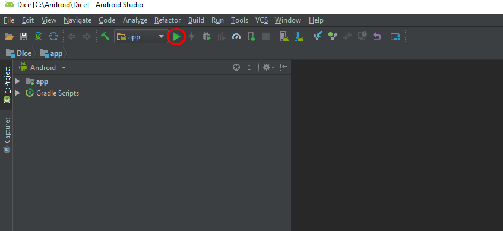
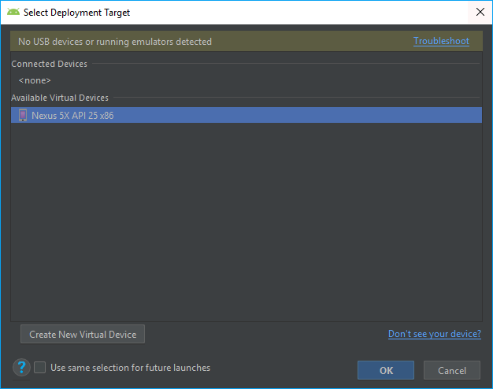
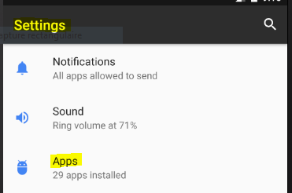
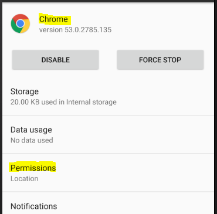
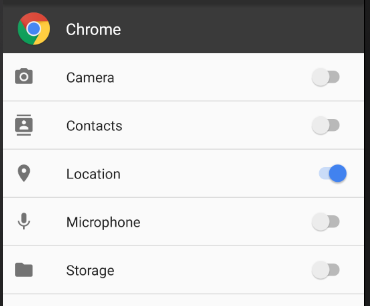

# Fonctionnement d'Android Studio

## Environnement de développement

Android studio fournis plein d'outils pour vous aider à développer, les plus importants étant :
* les SDK : ils sont chacun associés à une version d'Android minimale, c'est un ensemble d'outils et d'API qui vous permettent d’utiliser le téléphone portable et les outils Google ;
* Gradle : cet outil permet de gérer les dépendances de votre projet, d'en assurer la compilation, etc ;
* Logcat : gestion des logs.

### Émulation d'un téléphone

Afin de pouvoir aisément tester votre application, vous pouvez utiliser l'émulateur de téléphone (l'avantage par rapport l'utilisation d'un véritable smartphone est que vous pouvez envoyer des positions GPS facilement pour simuler l'utilisation de l'application mais également tester simplement d'autres versions d'Android).

Vous pouvez gérer téléphones *émulés* via le bouton `AVD Manager` :


Au lancement de votre application, Android Studio vous proposera de choisir le téléphone à utiliser.

### Gestion des SDK

Au premier démarrage d'Android Studio, nous avons téléchargé la dernière version du SDK Android et la version 24. Vous pouvez télécharger d'autres versions en ouvrant le `SDK Manager` :



(C'est en fait un raccourci vers [les options de configurations Android Studio](0_installation_android_studio.md#configuration-avanc%C3%A9e) déjà utilisées.)

Il n'y a pas que les SDK principaux, mais également d'autres outils (comme par exemple les Google Services qui permettent notamment de faire des cartes).

### Gradle

Gradle gère les dépendances et la compilation de votre projet. Gradle effectue régulièrement des synchronisations il faut attendre qu'elles soient terminées pour modifier votre code (notamment au début).

Le fichier de configuration principal de Gradle pour votre application est `Gradle Scripts/build.gradle (Module: app)`. Exemple de fichier :

```js
apply plugin: 'com.android.application'

android {
    compileSdkVersion 27
    defaultConfig {
        applicationId "fr.ign.vsasyan.twosidesofthecoin"
        minSdkVersion 15
        targetSdkVersion 27
        versionCode 1
        versionName "1.0"
        testInstrumentationRunner "android.support.test.runner.AndroidJUnitRunner"
    }
    buildTypes {
        release {
            minifyEnabled false
            proguardFiles getDefaultProguardFile('proguard-android.txt'), 'proguard-rules.pro'
        }
    }
}

dependencies {
    implementation fileTree(dir: 'libs', include: ['*.jar'])
    implementation 'com.android.support:appcompat-v7:27.1.1'
    implementation 'com.android.support.constraint:constraint-layout:1.1.3'
    testImplementation 'junit:junit:4.12'
    androidTestImplementation 'com.android.support.test:runner:1.0.2'
    androidTestImplementation 'com.android.support.test.espresso:espresso-core:3.0.2'
}
```

Vous pouvez voir :
* les SDK d'Android ciblé par votre application ;
* les dépendances.

Le panneau de gauche vous donnant la liste des fichiers composant votre application ne donne d'ailleurs pas la véritable structure des fichiers. C'est Gradle qui gère cela. (Donc si le panneau de gauche n'a pas la structure habituelle, cela est généralement dû à un problème de Gradle.)

Exemple du panneau de gauche VS la véritable structure des données :



### Compilation et lancement

Pour compiler votre projet, cliquez sur le bouton `Make Project` (Ctrl + F9) :



Cela permet de vérifier que tout est bon : pas d'erreur Java, les dépendances sont chargées, etc.

Pour lancer votre projet, cliquez sur le bouton `Run 'app'` (Maj + F10) :



Android Studio va alors vous demander de choisir où lancer votre application :
* sur un téléphone connecté à l'ordinateur ;
* sur un téléphone émulé.




## Organisation du code

### Fichier AndroidManifest

Le fichier contient les méta-données de l'application (nom, icône, etc) ainsi que la liste des activités de l'application et les permissions de l'application (connaître la position de l'utilisateur, accéder aux documents, prendre des photos, etc).

Localisation : `app/manifests/AndroidManifest.xml`

Exemple de code :

```xml
<?xml version="1.0" encoding="utf-8"?>
<manifest
    xmlns:android="http://schemas.android.com/apk/res/android"
    package="fr.ign.vsasyan.jourdelasemaine">

    <application
        android:allowBackup="true"
        android:icon="@mipmap/ic_launcher"
        android:label="Jour de la Semaine"
        android:supportsRtl="true"
        android:theme="@style/AppTheme">

        <!-- Aucune permission ici -->

        <activity android:name=".JourActivity">
            <!-- Une activité "Jour" -->
            <intent-filter>
                <!-- Qui est l'activité principale (lancé à démarrage de l’application) -->
                <action android:name="android.intent.action.MAIN" />
                <category android:name="android.intent.category.LAUNCHER" />
            </intent-filter>
        </activity>

    </application>

</manifest>
```

A partir d'Android 6, la gestion n'est plus simplement déclarative. Effectivement, avant l'utilisateur voyait les permissions requises par l'application et à partir du moment où l'application était installée elle pouvait faire tout ce qui était indiqué.

Maintenant vous pouvez choisir, pour chaque application, les permissions accordés.

Pour cela allez dans les options du téléphone et ouvrez le menu « Applications » :



Cliquez sur l'application dont vous souhaitez modifier les permissions et ouvrez le menu « Permissions » :



Vous pouvez alors activer ou désactiver chaque permission :




### Les activités (Vue/Contrôleur)

Votre application sera composée d'activités, à chaque activité est associée :
* un *fichier XML* décrivant la *vue* (les composants graphiques utilisés) ;
* un *fichier Java* permettant de *contrôler* l'application (actions, lancement de traitements, etc).

Android utilise donc le patron de conception *MVC* (Modèle Vue Contrôleur) destiné à répondre aux problèmes inhérents à la création d'interfaces graphiques.

Il permet de séparer :
* le **modèle** : les données manipulées (c'est à vous de créer les classe Java adaptées pour gérer vos données métier) ;
* la **vue** : la représentation/l'affichage des données (le **fichier XML** associé à votre activité) ;
* le **contrôleur** : la gestion logique des actions utilisateur (le **fichier Java** associé à votre activité).


### Gestion événementielle (Observateur/observable)

Pour gérer les événements (clic de l'utilisateur sur un bouton, fin d'un traitement), Android utilise le pattern Observateur/observable.

On définit une relation entre un objet (1) et d'autres objets (0..n) : si l'objet change d'état, tous les objets qui en dépendent sont informés du changement.

Vous allez créer un lien entre un objet Java (bouton par exemple) pour que quand un certain événement se produit (par exemple un clic de l'utilisateur) une certaine fonction soit exécutée (exactement comme en JavaScript).

Exemple en JavaScript :

```javascript
    // Définition de la fonction à exécuter au clic
    function deconnecterUtilisateur() {
        utilisateur.logout();
    }

    // Récupération du bouton (instanciation d'un objet JavaScript à partir de la page HTML)
    var bouton = document.getElementById("bouton");
    
    // Ajout d'un écouteur au bouton associé à l'événement "click"
    bouton.addEventListener("click", deconnecterUtilisateur);
```

Le principe en Java est exactement le même (sauf qu'en Java tout est objet, on ne donne donc pas une *fonction* à exécuter mais un *objet* dont une des méthodes sera exécutée).

```java
    // Je déclare mes variables (le bouton et l'écouteur d’événement)
    View.OnClickListener eventListener;
    Button b_button;

    // J'instancie l'écouteur d'événement : une classe avec une seule
    // méthode "onClick" qui sera exécutée au clic (d'où le nom...)
    eventListener = new View.OnClickListener() {
        @Override
        public void onClick(View v) {
            // La fonction à exécuter au clic
        }
    };

    // J'instancie le bouton : je récupère l’objet de l'interface
    // graphique et l'instancie en un objet Java qui le représente
    b_button = (Button)findViewById(R.id.b_button);

    // Je définie l’écouteur d'événement précédemment crée
    // comme étant l'écouteur de mon bouton
    b_button.setOnClickListener(eventListener);

```

En général on utilise un écouteur d'événement anonyme (on ne le stocke pas dans une variable, mais on le définit de suite comme écouteur à utiliser) :

```java
    // Je déclare ma variable (le bouton)
    Button b_button;

    // J'instancie le bouton : je récupère l’objet de l'interface
    // graphique et l'instancie en un objet Java qui le représente
    b_button = (Button)findViewById(R.id.b_button);

    // Je définie l’écouteur d'événement comme étant l'écouteur
    // de mon bouton au moment même où je l'instancie
    b_button.setOnClickListener(new View.OnClickListener() {
        @Override
        public void onClick(View v) {
            // La fonction à exécuter au clic
        }
    });

```


### Création des vues

Il y a deux méthodes pour créer des vues :
* par combinaison : création de toute l'interface au chargement de l'activité via un code java (très fastidieux) ;
* par **déclaration** : utilisation d'un **fichier XML** pour décrire la vue (l'instanciation en Java est faites automatiquement).

Nous utilisons principalement la seconde manière, mais il est tout à fait possible d'enrichir une vue dynamiquement via un code Java.

Il y a deux patrons de conception derrière les vues en Android :
* composite (gestion des groupe d'éléments) ;
* décorateur : altération des éléments).

#### Patron de conception Composite


Ce design pattern permet de manipuler les groupes d'objets comme s'il s'agissait d'un objet simple.

Chaque objet de la vue sera ou un élément (zone de text, bouton, ...) ou un groupe d'élément (LinearLayout, VerticalLayout, ...).

Cela permet d'organiser l'interface.

#### Patron de conception Décorateur


Ce design pattern permet d'encapsuler un composant pour lui ajouter des fonctionnalités.

Le décorateur se comportera comme le composant, avec une altération (propriété en plus, méthodes différentes, ...).

#### Organisation des composants

Pour bien positionner vos composants graphiques, vous pouvez utiliser des `LinearLayout` (verticaux ou horizontaux), des `GridLayout`, etc. Ces composants permettent de disposer facilement vos composants par rapport aux autres.

Lorsque vous avez trop de composants à afficher sur un même écran, vous pouvez utiliser un `ScrollView` pour ajouter une « barre de défilement » verticale. (Il y a aussi un `HorizontalScrollView` si vous avez besoin d'un défilement horizontal.)


### Modèle (DAO)

Le patron de conception Data Access Object permet de faire le lien entre la **couche métier** (les classes java) qui représente les **données métier** et la **couche persistante** (la base de donnée, des fichiers, ...) qui permet de **stocker les données**.

On a donc des classes qui **représentent la donnée** et d'autres qui servent à **gérer l’accès à la donnée** (à la lire, l'écrire, la supprimer, etc).


### Les ressources

Ce sont des fichiers (en général XML mais cela peut également être des images, etc.) qui stockent tout ce qui n'est pas du code Java : les textes, les illustrations, mais également les vues...

Il y a une gestion automatique des langues, des différentes résolutions de téléphones ou encore du mode d'orientation (portait/paysage).

Exemple pour le fichier `strings.xml` contenant les chaînes de caractères :

Localisation selon la langue :
* Anglais : `app/res/values/strings.xml` (par défaut)
* Français : `app/res/values-fr/strings.xml`

Cela permet de traduire facilement l’application, en particulier quand c'est couplé au formatage des string en Java.

```xml
<!-- values/string.xml -->
<resources>
    <string name="app_name" translatable="false">MyApp</string>
    <string name="local">en</string>
    <string name="result">Your result is: %f</string>
</resources>
```

```xml
<!-- values-fr/string.xml -->
<resources>
    <string name="app_name" translatable="false">MyApp</string>
    <string name="local">fr</string>
    <string name="result">Votre score est : %f</string>
</resources>
```

```java
    Locale locale = new Locale(getResources().getString(R.string.local));
    String stringToFormat = getResources().getString(R.string.result));
    String formatedString = String.format(Local.getDefault(), stringToFormat, 42.42);
```

Qui va afficher :
* en anglais : `Your result is: 42.42`
* en français : `Votre score est : 42,42`


## Rappel : le Java et les Objets Java

Java est un langage à **typage statique fort** (contrairement au JavaScript ou au PHP par exemple). Il faut donc déclarer les variables (donner le **type**) **avant** de les utiliser :

```java
    // Déclaration
    int unEntier;
    float unFlottant;
    String uneChaineDeCaracteres;

    // Utilisation
    unEntier = 40;
    unFlottant = 2.42;
    uneChaineDeCaracteres = "Je suis une chaîne de caractères...";

    // On peut également déclarer et utiliser en même temps :
    int unAutreEntier = 8;
```

Lorsque l'on utilise des Classes, il faut *toujours* **déclarer** et **instancier** la variable, avant de l'utiliser :

```java
    // Fichier : Chien.java

    // Définition de la classe Chien
    public class Chien {

        // Elle a un attribut nom qui est un String
        String nom;

        // Constructeur
        public Chien(String nom) {
            this.nom = nom;
        }

        // Méthode
        public aboyer() {
            System.out.println("%s : « Wouaf, wouaf ! »".format(this.nom));
        }
    }
```

```java
    // Fichier : appli.java

    // Importation de la classe
    import Chien;

    // 1) je déclare la variable :
    Chien chien1;

    // 2) j'instancie ma variable :
    chien1 = new Chien("Milou");

    // 3) j'utilise ma variable :
    milou.aboyer();


    // Erreur type 1 : pas de déclaration
    chien2 = new Chien("Rantanplan");
    // Dans ce cas l'éditeur Android Studio devrait souligner la variable chien2 avant
    // même la compilation en vous disant qu'il ne comprend pas d'où ça sort...

    // Erreur type 2 : pas d'instanciation
    Chien chien3;
    chien3.aboyer();
    // Dans ce cas vous aurez une erreur à l'exécution du code de type : "null does not have method aboyer"
```
