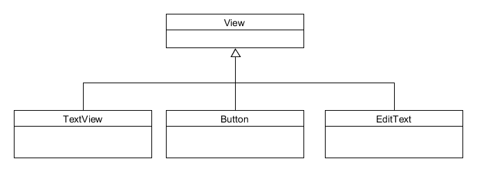

# Une deuxième application

Pour mettre en pratique l'utilisation d'Android Studio et prendre
en main un projet Android, nous allons créer une application simulant
un lancer de pièce (pile ou face).

[Résumé d'introduction](../1_ressources/3_premiere_application.pdf)

## Objectifs

Il y deux objectifs fondamentaux dans cette partie :
* revoir l'utilisation des objets en Java : Déclaration, Instanciation, Utilisation
* introduire le concept d'écoute événementielle.

## Le principe de l'application

L'application sera composée d'une vue permettant d'afficher du texte (`TextView`).
Il y aura, stockés dans les ressources, deux labels correspondants aux résultats
en anglais ("Tail" ou "Head").

Au démarrage de l'application, le programme génère un booléen aléatoirement égal à `true` ou `false`, et
affiche le label correspondant. L'utilisateur peut effectuer un nouveau lancer en cliquant sur un bouton.

## Mise en place

Créez un nouveau projet appelé "TwoSidesOfTheCoin". Utilisez, de même que pour la première, une activité vide et faites un projet en Java.


## Pas à pas des modifications

### 1) Modification de la vue

Dans un premier temps, il faut modifier la vue pour ajouter une zone de texte.
Modifier le `TextView` automatiquement ajouté par Android Studio : ajoutez-lui l'id `tv_coin_results`.

Vous pouvez effectuer cela en utilisant le mode *Design* (cliquez sur l'élément pour afficher ces attributs à droit) qui permet d'éditer facilement les composants graphiques. Cependant cette interface est limitée, et il est parfois plus rapide d'utiliser le mode *Text*.

Vous devez obtenir le code suivant :

```xml
        <TextView
            android:id="@+id/tv_coin_result"
            android:layout_width="wrap_content"
            android:layout_height="wrap_content" />
```

### 2) Ajout des labels dans les fichiers strings

Ouvrez le fichier `res/values/string.xml`. Vous pouvez voir qu'il y a déjà une ressource nommée `app_name` ayant pour valeur « TwoSidesOfTheCoin ».

Il faut ajouter deux ressources nommées `tail` et `head` avec pour valeur respective « Tail » et « Head » :

```xml
<resources>
    <string name="app_name">TwoSidesOfTheCoin</string>
    <string name="tail">Tail</string>
    <string name="head">Head</string>
</resources>
```

### 3) Modification de l'activité

Nous allons maintenant modifier l'activité (fichier `java/[nom de votre package]/MainActivity`). Pour rappel la méthode `onCreate` est exécutée à la création de l'activité. Comme cette activité est l'activité de démarrage de l'application, cette fonction sera exécutée sans intervention de l'utilisateur.

Vous pouvez voir qu'il y a deux lignes dans la fonction, celles qui permettent d'afficher la vue (voir [premier précédent](../1_premiere_application/README.md)). Vous devez effectuer vos modifications après.

On va ajouter une méthode à la classe, nommée `coinFlip` qui va simuler le lancement de la pièce, puis ajouter « Tail » ou « Head », à la ligne, dans le `TextView`.

#### a) Lancement de la pièce

```java
// Random generation of a boolean in Java
Random randomGenerator = new Random();
boolean random = randomGenerator.nextBoolean();

// Get labels in the resources
String tail = getString(R.string.tail);
String head = getString(R.string.head);

// String result = tail ou head ?
```


#### b) Afficher le résultat

Il faut dans un second temps récupérer le `TextView` de la vue, de manière à instancier un objet Java qui le représente.

Cela s'effectue grâce à la fonction `findViewById([ressource_id])` qui prend comme paramètre l'identifiant de votre contrôle graphique (qui est une ressource). Si votre élément s'appelle `tv_coin_result`, l'identifiant de ressource est : `R.id.tv_coin_result`.

Il faut donc déclarer votre variable (comme attribut de classe) :

```java
public class MainActivity extends AppCompatActivity {

    // Declaration of the class attribute to store the Java instance of the TextView
    TextView tv_coinResult;

    // ...
}
```

Puis instancier l'élément (dans la fonction `onCreate`) :

```java
    @Override
    protected void onCreate(Bundle savedInstanceState) {
        // ...

        // Retrieve the TextView and store it in the class attribute
        tv_coinResult = findViewById(R.id.tv_coin_result);
    }
```

Enfin il suffit de définir le texte de notre `TextView` (dans la méthode `coinFlip`) :

```java
    protected void coinFlip() {
        // ...

        // Set TextView text
        tv_coinResult.setText(result);
    }
```


Voici la fonction `coinFlip` à obtenir :

```java
    public void coinFlip() {
        // Random generation of a boolean in Java:
        Random randomGenerator = new Random();
        boolean random = randomGenerator.nextBoolean();

        // Get labels in the resources:
        String tail = getString(R.string.tail);
        String head = getString(R.string.head);

        // Result according to the random value
        String result;
        if (random) {
            result = tail;
        } else {
            result = head;
        }

        // Set TextView text
        tv_coinResult.setText(result);
    }
```

Il faut en suite appeler cette fonction dans la fonction `onCreate` (après avoir instancier le `TextView`) :

```java
    @Override
    protected void onCreate(Bundle savedInstanceState) {
        super.onCreate(savedInstanceState);
        setContentView(R.layout.activity_main);

        // I - Retrieve the graphical components
        tv_coinResult = findViewById(R.id.tv_coin_result);

        // III - Run other stuff
        coinFlip();
    }
```

#### Le point à retenir

La ligne la plus importante est :

```java
        // Retrieve the TextView and store it in the class attribute
        tv_coinResult = findViewById(R.id.tv_coin_result);
```

Cette ligne permet d'instancier en Java l'objet `TextView` correspondant au code XML écrit à l'étape **1)**.
La fonction `findViewById` de signature `View findViewById(String id)` est fournie par l'API d'Android. Elle permet de récupérer n'importe quel élément d'une vue et d'en faire un objet Java. Cela permet de pouvoir agir sur l'objet via une fonction Java.

Extrait du diagramme UML des composants graphiques :




#### Remarque sur les imports :

Remarquez les `import` à effectuer :

```java
import android.support.v7.app.AppCompatActivity;
import android.os.Bundle;
import android.widget.TextView;

import java.util.Random;
```

Vous utilisez des librairies, il faut donc les importer (Android Studio arrive très bien à vous proposer d'ajouter automatiquement les librairies les plus courantes, utilisez le `Alt+Entrer`).

### 4) Lancement de l'application

Connectez votre téléphone à l'ordinateur et lancez le programme dans Android Studio (`Maj+F10`).
Android Studio ouvre une fenêtre : sélectionnez votre mobile. L'application doit se lancer sur votre téléphone !

### 5) Ajout du bouton

Votre programme fonctionne ! On va maintenant ajouter un bouton pour que l'utilisateur puisse relancer la pièce !

Ajouter un bouton dans la vue, en haut, nommez-le `b_coin_flip`. Personnalisez le label du bouton en utilisant une ressource...

Pour que tout s'organise bien, positionnez le `Button` et le `TextView` dans un `LinearLayout` à l'orientation verticale.

Voici le code XML obtenu :

```xml
<?xml version="1.0" encoding="utf-8"?>
<androidx.constraintlayout.widget.ConstraintLayout xmlns:android="http://schemas.android.com/apk/res/android"
    xmlns:app="http://schemas.android.com/apk/res-auto"
    xmlns:tools="http://schemas.android.com/tools"
    android:layout_width="match_parent"
    android:layout_height="match_parent"
    tools:context=".MainActivity">

    <LinearLayout
        android:layout_width="match_parent"
        android:layout_height="match_parent"
        android:orientation="vertical">

        <Button
            android:id="@+id/b_coin_flip"
            android:layout_width="match_parent"
            android:layout_height="wrap_content"
            android:text="@string/flip" />

        <TextView
            android:id="@+id/tv_coin_result"
            android:layout_width="wrap_content"
            android:layout_height="wrap_content" />
    </LinearLayout>

</androidx.constraintlayout.widget.ConstraintLayout>
```

Nous voulons que Java génère un événement lorsque l'utilisateur clique sur le bouton.
Pour cela, nous devons ajouter un *event listener* (écouteur d'événement) au bouton.

Il va falloir instancier le `Button` en objet Java (comme nous l'avons fait pour le `TextView`) :
1. ajoutez une déclaration en attribut de classe pour stocker le bouton ;
2. instancier le bouton dans la méthode `onCreate`.

Maintenant, nous devons ajouter l'écouteur d'événement. Nous allons utiliser la fonction `setOnClickListener` :

```java
    protected void onCreate(Bundle savedInstanceState) {
        // ...

        // II - Add Event Listener
        // Add an anonymous "OnClickListener" event listener to the "Button" object "b_coin_flip"
        b_coin_flip.setOnClickListener(new View.OnClickListener() {
            @Override
            public void onClick(View v) {
                // Here we call the function that flip the coin
                MainActivity.this.coinFlip();
            }
        });

        // ...
    }
```

Dans ce code, est instancié un écouteur d'événement anonyme (non stocké dans une variable) et directement définit comme l'écouteur d'événement du bouton.

La fonction `onClick` de cet écouteur est appelée au clic sur le bouton.

On fait alors appel à la fonction qu'on a crée précédemment, attention, nous ne sommes plus dans la classe `MainActivity`, il ne faut pas faire simplement `this.coinFlip()`, mais `MainActivity.this.coinFlip()`.

Vous pouvez modifier le programme pour *ajouter* le dernier lancé au `TextView`... (Il faudra lors ajouter un `ScrollView` autour du `TextView`...)

Voici la structure globale attendue :

```java
public class MainActivity extends AppCompatActivity {

    // Declaration of the class attribute to store the Java instance of the TextView
    TextView tv_coinResult;
    Button b_coin_flip;

    @Override
    protected void onCreate(Bundle savedInstanceState) {
        super.onCreate(savedInstanceState);
        setContentView(R.layout.activity_main);

        // I - Retrieve the graphical components
        tv_coinResult = findViewById(R.id.tv_coin_result);

        // II - Add Event Listener
        // Add an anonymous "OnClickListener" event listener to the "Button" object "b_coin_flip"
        b_coin_flip.setOnClickListener(new View.OnClickListener() {
            @Override
            public void onClick(View v) {
                // Here we call the function that flip the coin
                MainActivity.this.coinFlip();
            }
        });

        // III - Run other stuff
        coinFlip();
    }

    protected void coinFlip() {
        // Random generation of a boolean in Java
        Random randomGenerator = new Random();
        boolean random = randomGenerator.nextBoolean();

        // Get labels in the resources
        String tail = getString(R.string.tail);
        String head = getString(R.string.head);

        // Result according to the random value
        String result;
        if (random) {
            result = tail;
        } else {
            result = head;
        }

        // Get previous content
        String previousContent = tv_coinResult.getText().toString();
        if (!previousContent.equals("")) {
            previousContent = previousContent + '\n';
        }

        // Set TextView text
        tv_coinResult.setText(previousContent + result);
    }
}
```

### Paysage

Il est possible d'avoir une vue différente selon l'orientation du téléphone.

Ouvrez la vue, allez sur l'icône d'orientation et cliquez sur « Create landscape version » :


On peut par exemple mettre le `LinearLayout` en orientation `horizontal`.


## Les points à retenir

Les **ressources** permettent de gérer des *vues*, des images et des *constantes* (chaînes de caractères et autres).

Les **méthodes** associées aux **activités** permettent de coder des fonctionnalités.

Il est possible d'**accéder aux éléments des vues depuis ces méthodes** pour agir dessus et transmettre des informations aux utilisateurs.

Beaucoup de **composants graphiques** existent déjà pour vous aider à développer des interfaces riches sans efforts.

Pour **agir sur les composants graphiques** il faut :
* **instancier des objets Java représentant ces composants** (via `findViewById`) ;
* leur associer des **écouteurs d'événements**.

## Organisation du code

Pour ne pas faire d'erreur sur la déclaration et l'instanciation des composants graphique, je vous conseil fortement de :
* déclarer toutes les variables de composants comme attributs de classe (vous pourrez simplement accéder à tous les composants dans toutes les fonctions de classe) ;
* instancier tous les composants dès le début de la fonction `onCreate`;
* associer les écouteurs d'événement aux composants juste après (créez sur votre classe d'activité une méthode à éxécuter pour chaque écouteur d'événement).

## Projet complet

Vous pouvez retrouver le projet complet ici : [https://gitlab.com/vsasyan/TwoSidesOfTheCoin](https://gitlab.com/vsasyan/TwoSidesOfTheCoin)
