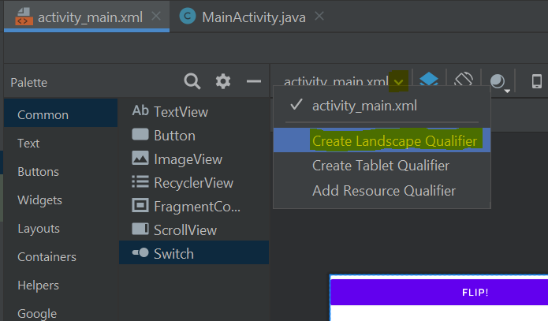

# Une deuxième application : Pile ou Face

Une deuxième application capable d'interagir avec l'utilisateur simulant
un lancer de pièce (pile ou face).

## Objectifs

Il y trois objectifs fondamentaux dans cette partie :
* revoir l'utilisation des objets en Java : Déclaration, Instanciation, Utilisation
* introduire le concept d'écoute événementielle ;
* voir l'organisation des composants graphiques.

## Le principe de l'application

L'application sera composée d'une vue permettant d'afficher du texte (`TextView`).
Il y aura, stockés dans les ressources, deux strings correspondants aux résultats
en anglais ("Tail" ou "Head").

Au démarrage de l'application, le programme génère un booléen aléatoirement égal à `true` ou `false`, et affiche le label correspondant. L'utilisateur peut effectuer un nouveau lancer en cliquant sur un bouton.

## Mise en place

Créez un nouveau projet appelé `TwoSidesOfTheCoin`. Utilisez, de même que pour la première, une **activité vide** et faites un projet en Java.


## Pas à pas des modifications

### 1) Modification de la vue

Passez en mode design.

Dans un premier temps, il faut supprimer les composants créés par Android Studio : dans l'onglet *Component Tree* en bas à gauche, supprimez tout sauf le `ConstraintLayout` à la racine.

Puis nous allons ajouter un `LinearLayout` (vertical), pour organiser les éléments, avec dedans :
* un `Button` ;
* un `TextView`.

Cherchez les composants dans la Palette en haut à gauche et faites les glisser.

Vous devez obtenir :


Cliquez sur le `Button`, et dans le volet Attributes :
* définissez l'id à `b_flip_coin` ;
* cliquez à droite du champs `text` sur « Pick a Resource », créez un nouvelle ressource nommée `flip_coin` et de valeur `Flip!`.

Cliquez sur le `TextView`, et dans le volet Attributes :
* définissez l'id à `tv_coin_result` ;
* videz le champs `text`.

Vous devez obtenir le code suivant (mode text) :

```xml
<?xml version="1.0" encoding="utf-8"?>
<androidx.constraintlayout.widget.ConstraintLayout xmlns:android="http://schemas.android.com/apk/res/android"
    xmlns:app="http://schemas.android.com/apk/res-auto"
    xmlns:tools="http://schemas.android.com/tools"
    android:layout_width="match_parent"
    android:layout_height="match_parent"
    tools:context=".MainActivity">

    <LinearLayout
        android:layout_width="match_parent"
        android:layout_height="match_parent"
        android:orientation="vertical">

        <Button
            android:id="@+id/b_flip_coin"
            android:layout_width="match_parent"
            android:layout_height="wrap_content"
            android:text="@string/flip_coin" />

        <TextView
            android:id="@+id/tv_coin_result"
            android:layout_width="match_parent"
            android:layout_height="wrap_content" />
    </LinearLayout>
</androidx.constraintlayout.widget.ConstraintLayout>
```

### 2) Ajout des labels dans les fichiers strings

Ouvrez le fichier `res/values/string.xml`. Vous pouvez voir qu'il y a déjà deux ressources :
* une nommée `app_name` ayant pour valeur « TwoSidesOfTheCoin » ;
* une nommée `flip_coin` ayant pour valeur « Flip! » ;

Il faut ajouter deux ressources nommées `tail` et `head` avec pour valeur respective « Tail » et « Head » :

```xml
<resources>
    <string name="app_name">TwoSidesOfTheCoin</string>
    <string name="flip_coin">Flip!</string>
    <string name="tail">Tail</string>
    <string name="head">Head</string>
</resources>
```

### 3) Modification de l'activité

Nous allons maintenant modifier l'activité (fichier `java/[nom de votre package]/MainActivity`). Pour rappel la méthode `onCreate` est exécutée à la création de l'activité. Comme cette activité est l'activité de démarrage de l'application, cette méthode sera exécutée sans intervention de l'utilisateur.

Vous pouvez voir qu'il y a deux lignes dans la méthode, celles qui permettent d'afficher la vue (voir [précédemment](../1_hello_world/README.md)). Vous devez effectuer vos modifications après.

Pour simuler le lancement de la pièce, nous voulons mettre « Tail » ou « Head » dans le `TextView`. Pour cela, il va falloir instancier le composant graphique en Java afin d'agir sur celui-ci.

Ensuite, nous allons ajouter une méthode à la classe, nommée `protected void coinFlip()` qui va simuler le lancement de la pièce, puis ajouter « Tail » ou « Head », à la ligne, dans le `TextView`.

#### a) Instanciation du composant graphique

Dans un premier temps, nous déclarons un attribut de classe permettant de manipuler le composant en Java.

Ajoutez au début de la classe :

```java
public class MainActivity extends AppCompatActivity {

    // Déclaration d'un attribut de classe pour stocker l'instance Java du TextView
    TextView tv_coinResult;

    // ...
}
```

Dans un deuxième temps, dans la méthode `onCreate`, après l'initialisation de l'interface, nous allons ajouter l'instanciation de notre composant graphique :

```java
    @Override
    protected void onCreate(Bundle savedInstanceState) {
        // ...

        // Instanciation du TextView en attribut de classe
        tv_coinResult = findViewById(R.id.tv_coin_result);
    }
```

Enfin, nous pouvons utiliser l'attribut de classe pour agir sur le composant graphique.

Ajoutez dans `onCreate` une ligne pour définir le text du composant :

```java
    @Override
    protected void onCreate(Bundle savedInstanceState) {
        // ...

        // On définit le texte du TextView
        tv_coinResult.setText("Coucou !");
    }
```

Lancez votre application pour vérifier qu'elle fonctionne :


#### b) Lancement de la pièce

On veut maintenant simuler le lancement de la pièce et mettre « Tail » ou « Head » dans le `TextView`.

Nous allons ajouter à la classe une méthode `coinFlip()` qui va faire cela :

```java
    protected void coinFlip() {
        // Génération aléatoire d'un booléen en Java
        Random randomGenerator = new Random();
        boolean random = randomGenerator.nextBoolean();

        // Récupération des string dans les ressources
        String tail = getString(R.string.tail);
        String head = getString(R.string.head);

        // Définition de la valeur selon le résultat
        String result = tail;
        if (random) {
            result = head;
        }

        // Modification du composant graphique
        tv_coinResult.setText(result);
    }
```

Si une classe n'est pas connue par Android Studio, positionnez le curseur dessus et cliquez sur `<Alt>` + `<Entrée>`, le programme vous proposera d'importer ce qu'il manque (ici `java.util.Random`).

Remarquez que l'en-tête de la méthode `coinFlip()` est grisé :


**Cette méthode n'est jamais appelée...**

Il reste à appeler cette méthode depuis `onCreate` pour qu'elle soit automatiquement appelée au démarrage :

```java
    @Override
    protected void onCreate(Bundle savedInstanceState) {
        // ...

        // On appelle coinFlip
        coinFlip();
    }
```

La méthode `coinFlip()` maintenant être colorée, cliquez sur *1 usage* pour accéder à ses appels :


Lancez votre application pour vérifier qu'elle fonctionne :


#### Le point à retenir

La ligne la plus importante est :

```java
        // Instanciation du TextView en attribut de classe
        tv_coinResult = findViewById(R.id.tv_coin_result);
```

Cette ligne permet d'instancier en Java l'objet `TextView` correspondant au code XML écrit à l'étape **1)**.
La méthode `findViewById` de signature `View findViewById(String id)` est fournie par l'API d'Android. Elle permet de récupérer n'importe quel élément d'une vue et de l'instancier en Java. Cela permet de pouvoir agir sur l'objet via une méthode Java.


#### Remarque sur les imports :

Remarquez les `import` à effectuer :

```java
import androidx.appcompat.app.AppCompatActivity;

import android.os.Bundle;
import android.widget.TextView;

import java.util.Random;
```

Vous utilisez des librairies, il faut donc les importer (Android Studio arrive très bien à vous proposer d'ajouter automatiquement les librairies les plus courantes, utilisez le `Alt+Entrer`).

### 4) Ajout du bouton

Votre programme fonctionne !

On va maintenant programmer le bouton pour que l'utilisateur puisse relancer la pièce.

Nous voulons exécuter une action lorsque l'utilisateur clique sur le bouton.
Pour cela, nous devons ajouter un *event listener* (écouteur d'événement) associé au bouton.

Il va falloir instancier le `Button` en objet Java (comme nous l'avons fait pour le `TextView`) :
1. ajoutez une déclaration en attribut de classe pour stocker le bouton ;
2. instancier le bouton dans la méthode `onCreate`.

Maintenant, nous devons ajouter l'écouteur d'événement. Nous allons utiliser la méthode `setOnClickListener` :

```java
    protected void onCreate(Bundle savedInstanceState) {
        // ...

        // Ajout de l'écouteur d'événement
        b_flip_coin.setOnClickListener(new View.OnClickListener() {
            @Override
            public void onClick(View v) {
                // On appel la méthode pour lancer la pièce
                MainActivity.this.coinFlip();
            }
        });

        // ...
    }
```

Dans ce code, est instancié un écouteur d'événement anonyme (non stocké dans une variable) et directement définit comme l'écouteur d'événement du bouton.

La méthode `onClick` de cet écouteur est appelée au clic sur le bouton.

On fait alors appel à la méthode qu'on a crée précédemment, attention, nous ne sommes plus dans la classe `MainActivity`, il ne faut pas faire simplement `this.coinFlip()`, mais `MainActivity.this.coinFlip()`.

Vous pouvez modifier le programme pour *ajouter* le dernier lancé au `TextView`... (Il faudra lors ajouter un `ScrollView` autour du `TextView`...)

Voici la structure globale attendue :

```java
public class MainActivity extends AppCompatActivity {
    // Déclaration des attributs de classe pour stocker les instances Java des composants graphiques
    TextView tv_coinResult;
    Button b_flip_coin;

    @Override
    protected void onCreate(Bundle savedInstanceState) {
        super.onCreate(savedInstanceState);
        setContentView(R.layout.activity_main);

        // Instanciation des composants graphiques
        tv_coinResult = findViewById(R.id.tv_coin_result);
        b_flip_coin = findViewById(R.id.b_flip_coin);

        // Ajout de l'écouteur d'événement
        b_flip_coin.setOnClickListener(new View.OnClickListener() {
            @Override
            public void onClick(View v) {
                // On appel la méthode pour lancer la pièce
                MainActivity.this.coinFlip();
            }
        });

        // On appelle coinFlip
        coinFlip();
    }

    protected void coinFlip() {
        // Génération aléatoire d'un booléen en Java
        Random randomGenerator = new Random();
        boolean random = randomGenerator.nextBoolean();

        // Récupération des string dans les ressources
        String tail = getString(R.string.tail);
        String head = getString(R.string.head);

        // Définition de la valeur selon le résultat
        String result = tail;
        if (random) {
            result = head;
        }

        // Récupération du contenu
        String previousContent = tv_coinResult.getText().toString();
        if (!previousContent.equals("")) {
            result = previousContent + '\n' + result;
        }

        // Modification du composant graphique
        tv_coinResult.setText(result);
    }
}
```

### Paysage

Il est possible d'avoir une vue différente selon l'orientation du téléphone.

Ouvrez la vue, cliquez sur le nom du fichier et choisissez *Create landscape qualifier* :



On peut par exemple mettre le `LinearLayout` en orientation `horizontal`, et modifier le bouton pour qu'il occupe l'espace dans la hauteur :

```xml
<?xml version="1.0" encoding="utf-8"?>
<androidx.constraintlayout.widget.ConstraintLayout xmlns:android="http://schemas.android.com/apk/res/android"
    xmlns:app="http://schemas.android.com/apk/res-auto"
    xmlns:tools="http://schemas.android.com/tools"
    android:layout_width="match_parent"
    android:layout_height="match_parent"
    tools:context=".MainActivity">

    <LinearLayout
        android:layout_width="match_parent"
        android:layout_height="match_parent"
        android:orientation="horizontal">

        <Button
            android:id="@+id/b_flip_coin"
            android:layout_width="wrap_content"
            android:layout_height="match_parent"
            android:text="@string/flip_coin" />

        <ScrollView
            android:layout_width="match_parent"
            android:layout_height="match_parent">

            <LinearLayout
                android:layout_width="match_parent"
                android:layout_height="wrap_content"
                android:orientation="vertical">

                <TextView
                    android:id="@+id/tv_coin_result"
                    android:layout_width="match_parent"
                    android:layout_height="wrap_content" />
            </LinearLayout>
        </ScrollView>

    </LinearLayout>
</androidx.constraintlayout.widget.ConstraintLayout>
```

Relancez l'application et tournez le téléphone. Vous pouvez remarquer que le contenu est perdu.

Comme dans l'exercice précédent, ajoutez des logs sur les méthodes liées au cycle de vie de l'activité :

```
2020-01-01 01:01:01.176 8912-8912/fr.ign.twosidesofthecoin I/ENSG: onPause
2020-01-01 01:01:01.179 8912-8912/fr.ign.twosidesofthecoin I/ENSG: onStop
2020-01-01 01:01:01.180 8912-8912/fr.ign.twosidesofthecoin I/ENSG: onDestroy
2020-01-01 01:01:01.230 8912-8912/fr.ign.twosidesofthecoin I/ENSG: onCreate
2020-01-01 01:01:01.235 8912-8912/fr.ign.twosidesofthecoin I/ENSG: onStart
2020-01-01 01:01:01.237 8912-8912/fr.ign.twosidesofthecoin I/ENSG: onResume
```

Vous pouvez remarquer que l'activité est totalement reconstruite.

Pour conserver nos données, il faudra utiliser les méthodes `onSaveInstanceState` et `onRestoreInstanceState`.

Ici on ne veut sauver (et récupérer) que le contenu de notre `TextView` :

```java
public class MainActivity extends AppCompatActivity {
    // On déclare une constante qui servira de "clé"
    static final String TEXT_VIEW_CONTENT = "TEXT_VIEW_CONTENT";

    // ...

    @Override
    protected void onSaveInstanceState(Bundle outState) {
        // On ajout à l'objet Bundle le contenu du TextView, associé à la clef
        outState.putString(TEXT_VIEW_CONTENT, tv_coinResult.getText().toString());

        super.onSaveInstanceState(outState);
    }

    @Override
    protected void onRestoreInstanceState(Bundle savedInstanceState) {
        // On récupère de l'objet Bundle la valeur associée à la clef
        String savedValue = savedInstanceState.getString(TEXT_VIEW_CONTENT);
        // On défini le contenu du TextView
        tv_coinResult.setText(savedValue);

        super.onRestoreInstanceState(savedInstanceState);
    }
}
```

Les [Bundle](https://developer.android.com/reference/kotlin/android/os/Bundle?hl=en) sont une classe spécialisée permettant de stocker des couples clef/valeur.

Le contenu est alors correctement sauvé. Plus d'informations sur la [documentation](https://developer.android.com/guide/components/activities/activity-lifecycle#saras).

## Les points à retenir

Les **ressources** permettent de gérer des *vues*, des images et des *constantes* (chaînes de caractères et autres).

Les **méthodes** associées aux **activités** permettent de coder des fonctionnalités.

Il est possible d'**accéder aux éléments des vues depuis ces méthodes** pour agir dessus et transmettre des informations aux utilisateurs.

Beaucoup de **composants graphiques** existent déjà pour vous aider à développer des interfaces riches rapidement.

Pour **agir sur les composants graphiques** il faut :
* **déclare** des variables/attributs Java représentants ces composants** ;
* **instancier** ces variables/attributs (via `findViewById`) ;
* **utiliser** ces variables/attributs (leur associer des **écouteurs d'événements**, modifier les attributs, etc.).

On peut créer des **variations de chaque vue d'activité** selon l'orientation de l'écran, le type d'appareil, etc.

## Organisation du code

Pour ne pas faire d'erreur sur la déclaration et l'instanciation des composants graphique, je vous conseil fortement de :
* déclarer toutes les variables de composants comme attributs de classe (vous pourrez simplement accéder à tous les composants dans toutes les méthode de classe) ;
* instancier tous les composants dès le début de la méthode `onCreate`;
* associer les écouteurs d'événement aux composants juste après.

## Projet complet

Vous pouvez retrouver le projet complet ici : [https://gitlab.com/vsasyan/AndroidENSG-codes/tree/master/TwoSidesOfTheCoin](https://gitlab.com/vsasyan/AndroidENSG-codes/tree/master/TwoSidesOfTheCoin)

Aller au tutoriel suivant : [Google Services](../3_google_services/README.md)
