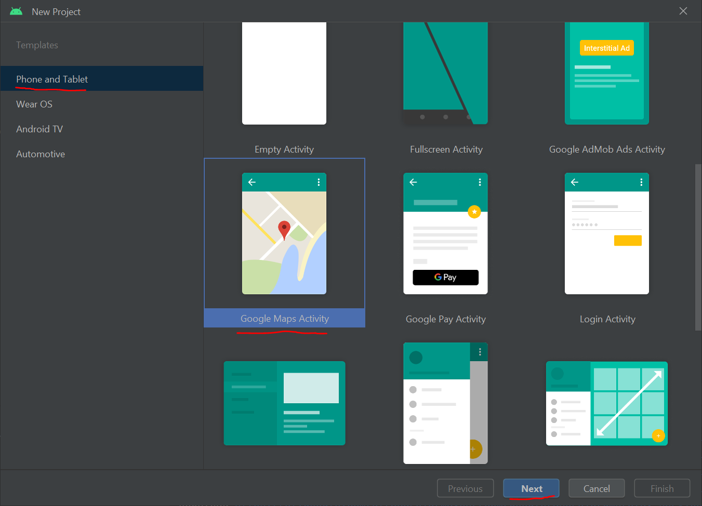

# Google Services

Google fournis énormément d'outils pour enrichir son écosystème. Nous allons voir ceux utiles en géomatique.

## Objectifs

Nous allons utiliser :
* GoogleServices pour se géolocaliser ;
* GoogleMaps pour afficher une carte ;
* les géo-codage de Google pour récupérer une adresse à partir d'une position GPS.

## Le principe de l'application

Nous allons créer une application permettant à utilisateur :
* d'afficher une carte
* se géolocaliser et connaître son adresse actuelle.

## Mise en place

Comme pour votre première application, créez un nouveau projet nommé `PositionName`.

Choisissez cette fois ci une Activity de base de type « Google Maps Activity » :



Et concervez le nom de `MapsActivity` :


## Pas à pas des modifications

### 1) Clé d'API

A la création de votre projet, Android Studio doit vous ouvrir le fichier `res/values/google_maps_api.xml`. Si ce n'est pas le cas, faites-le.

Ce document vous explique comment récupérer la clé d'API Google pour utiliser les cartes.

Il faut suivre un lien de type :

`https://console.developers.google.com/flows/enableapi?apiid=maps_android_backend&keyType=CLIENT_SIDE_ANDROID&...`

Par défaut, votre clé est liée :
* à une certaine application (ici `fr.ign.vsasyan.positionname`) ;
* à une certaine machine (dont la clé est ici : `C2:B1:46:9D:D7:CD:1D:C7:78:48:1F:17:CA:2C:57:23:77:96:3A:42`).

Le but est d'empêcher d'autres personnes d'utiliser votre clé. Si vous suivez ce lien, les informations seront automatiquement transmises à la création de la clé.

La création de la clé se déroule en quelques étapes :
* création d'un projet (jusqu'à 6 différents gratuitement) ;
* activation de l'API dans ce projet (ici l'API Google Maps Android) ;
* création d'une clé associée à ce projet.

Une fois la clé créée, il vous est proposé d'ajouter des restriction, si vous le faites, vous verrez comme restriction les paramètres présentés précédemment :


Je vous conseille de ne pas mettre de restriction (pour le moment, en développement), ainsi lorsque vos projets seront compilés sur un autre ordinateur (pour travailler chez vous ou au moment de la correction) il n'y aura pas besoin de changer les clés d'API. De plus, vous pourrez utiliser la même clé pour tous vos projets.

Pour terminer, copiez-collez la clé et mettez-là dans le document XML :


Lancez l'application, la carte devrait s'afficher...

Sur un Android récent (> 6), la carte peut automatiquement demander à accéder à votre position. Autorisez-là.

### 2) Visualisation du code

#### a) Fichier AndroidManifest

Nous allons dans un premier temps nous intéresser au fichier `AndroidManifest` (ici présenté sans les commentaires) :

```xml
<?xml version="1.0" encoding="utf-8"?>
<manifest xmlns:android="http://schemas.android.com/apk/res/android"
    package="fr.ign.positionname">

    <uses-permission android:name="android.permission.ACCESS_FINE_LOCATION" />

    <application
        android:allowBackup="true"
        android:icon="@mipmap/ic_launcher"
        android:label="@string/app_name"
        android:roundIcon="@mipmap/ic_launcher_round"
        android:supportsRtl="true"
        android:theme="@style/AppTheme">

        <meta-data
            android:name="com.google.android.geo.API_KEY"
            android:value="@string/google_maps_key" />

        <activity
            android:name=".MapsActivity"
            android:label="@string/title_activity_maps">
            <intent-filter>
                <action android:name="android.intent.action.MAIN" />

                <category android:name="android.intent.category.LAUNCHER" />
            </intent-filter>
        </activity>
    </application>

</manifest>
```

Comme vous pouvez le voir, Android Studio a ajouté des lignes par rapport au projet précédent.

La première concerne l'accès à la position de l'utilisateur :

```xml
    <uses-permission android:name="android.permission.ACCESS_FINE_LOCATION" />
```

La seconde concerne la clé d'API Google :

```xml
        <meta-data
            android:name="com.google.android.geo.API_KEY"
            android:value="@string/google_maps_key" />
```

#### b) Layout

Dans un deuxième temps, regardons le fichier `activity_maps.xml` décrivant la vue de notre application :

```xml
<fragment xmlns:android="http://schemas.android.com/apk/res/android"
    xmlns:tools="http://schemas.android.com/tools"
    xmlns:map="http://schemas.android.com/apk/res-auto"
    android:layout_width="match_parent"
    android:layout_height="match_parent"
    android:id="@+id/map"
    tools:context="fr.ign.vsasyan.positionname.MapsActivity"
    android:name="com.google.android.gms.maps.SupportMapFragment"/>
```

Comme vous pouvez le voir, il n'y a qu'un fragment, qui est un composant spécial permettant de réutiliser des vues. [Plus d'information.](https://developer.android.com/guide/components/fragments.html)

Cela permet de réutiliser certaines partie d'interfaces graphiques.

#### c) Java

Enfin nous allons nous intéresser au fichier `MapsActivity.java` :

```java
package fr.ign.vsasyan.positionname;

import android.support.v4.app.FragmentActivity;
import android.os.Bundle;

import com.google.android.gms.maps.CameraUpdateFactory;
import com.google.android.gms.maps.GoogleMap;
import com.google.android.gms.maps.OnMapReadyCallback;
import com.google.android.gms.maps.SupportMapFragment;
import com.google.android.gms.maps.model.LatLng;
import com.google.android.gms.maps.model.MarkerOptions;

public class MapsActivity extends FragmentActivity implements OnMapReadyCallback {

    private GoogleMap mMap;

    @Override
    protected void onCreate(Bundle savedInstanceState) {
        super.onCreate(savedInstanceState);
        setContentView(R.layout.activity_maps);
        // Obtain the SupportMapFragment and get notified when the map is ready to be used.
        SupportMapFragment mapFragment = (SupportMapFragment) getSupportFragmentManager().findFragmentById(R.id.map);
        mapFragment.getMapAsync(this);
    }

    /**
     * Manipulates the map once available.
     * This callback is triggered when the map is ready to be used.
     * This is where we can add markers or lines, add listeners or move the camera. In this case,
     * we just add a marker near Sydney, Australia.
     * If Google Play services is not installed on the device, the user will be prompted to install
     * it inside the SupportMapFragment. This method will only be triggered once the user has
     * installed Google Play services and returned to the app.
     */
    @Override
    public void onMapReady(GoogleMap googleMap) {
        mMap = googleMap;

        // Add a marker in Sydney and move the camera
        LatLng sydney = new LatLng(-34, 151);
        mMap.addMarker(new MarkerOptions().position(sydney).title("Marker in Sydney"));
        mMap.moveCamera(CameraUpdateFactory.newLatLng(sydney));
    }
}
```


##### onCreate

Dans la fonction onCreate, on peut voir qu'il y a trois nouvelles lignes :

```java
        // Obtain the SupportMapFragment and get notified when the map is ready to be used.
        SupportMapFragment mapFragment = (SupportMapFragment) getSupportFragmentManager()
                .findFragmentById(R.id.map);
        mapFragment.getMapAsync(this);
```

La première sert à récupérer le fragment de la vue et à l'instancier en objet java de type `SupportMapFragment`.
La seconde permet de lancer le chargement de la carte. Ce chargement n'est pas instantané et va être effectué de manière asynchrone (en arrière plan) afin de ne pas bloquer l'interface utilisateur. Une fois ce chargement effectué, le programme exécutera une fonction.

Le paramètre de la fonction `getMapAsync` doit être de type `OnMapReadyCallback`. Or notre classe java est une activité...

##### implements

Si on regarde la ligne de déclaration :

```java
public class MapsActivity extends FragmentActivity implements OnMapReadyCallback {...}
```

On voit que notre activité implémente l'interface `OnMapReadyCallback`, en faisant un `Ctrl + clic gauche` sur cette interface, vous pouvez voir sa signature :

```java
public interface OnMapReadyCallback {
    void onMapReady(GoogleMap var1);
}
```

En déclarant implémenter cette interface, notre activité **doit** avoir une fonction `onMapReady`, de signature `void onMapReady(GoogleMap var1)`. C'est cette fonction qui sera exécutée quand la carte sera chargée.

On parle ici de **callback**, cela ressemble bien évidement beaucoup à de l'**écoute événementielle** (exécuter une certain fonction lorsque qu'un certain événement se produit).

##### onMapReady

Nous allons enfin nous intéresser à la fonction `onMapReady`. Elle prend en paramètre un objet de type GoogleMap, c'est l'objet qui représente la carte affichée à l'utilisateur.

Une fois que cette fonction sera exécutée, nous pourrons interagir avec la carte (ajouter des balises, modifier la position, etc).

Remarquez que la fonction récupère l'objet java dans l'attribut de classe `private GoogleMap mMap` déclaré plus haut.

N'importe où dans votre code, lorsque vous avez besoin d'interagir avec la carte, vous **devez** vérifier que votre carte est bien instanciée, c'est à dire que `mMap != null`.

### 3) Modifier la carte

Il y a déjà un code qui affiche une balise sur la carte, modifiez le code pour afficher l'ENSG et centrer la carte dessus.

Modifiez le code concernant la `CameraUpdateFactory` pour définir également un zoom, 14 sera bien adapté.

Voici la documentation pour vous aider à trouver la bonne fonction à appeler... : [CameraUpdateFactory](https://developers.google.com/android/reference/com/google/android/gms/maps/CameraUpdateFactory)

Vous pouvez aussi afficher les outils de zoom de la carte : `mMap.getUiSettings().setZoomControlsEnabled(true);` (très utile sur émulateur...).

### 4) Position de l'utilisateur

Nous allons maintenant tenter d'afficher la position de l'utilisateur sur la carte.

La carte fournie par Google est bien évidement déjà capable de le faire.... L'intérêt de le faire par nous même est de pouvoir récupérer les coordonnées GPS de l'utilisateur, pour ensuite trouver son adresse.

Il a deux manières principales de récupérer la position du client ([documentation](https://developer.android.com/training/location/index.html)) :
* récupérer la dernière position connue ;
* demander un suivi de position.

La première méthode est instantanée, la deuxième va demander de mettre en place un système de callback : il faudra exécuter une certain fonction à chaque mise à jours de position.

En premier lieu, ajoutez une dépendance dans le fichier de configuration de Gradle `Gradle Scripts/build.gradle (Module: app)` :
```js
dependencies {
    // ...
    implementation 'com.google.android.gms:play-services-location:17.0.0'
}
```

Attention, les dépendances `com.google.android.gms:play-services***` présentes doivent avoir la même version (donc ici `17.0.0`).

Synchronisez Gradle.

#### a) Première méthode

Ajoutez un `FusedLocationProviderClient` en attribut de classe permettant d'accéder à l'API :

```java
public class MapsActivity extends FragmentActivity implements OnMapReadyCallback {

    private GoogleMap mMap;
    private FusedLocationProviderClient mFusedLocationClient;

    // ...
}
```

Ensuite, dans la suite de la fonction `onCreate`, il va falloir instancier ce client :

```java
mFusedLocationClient = LocationServices.getFusedLocationProviderClient(this);
```

Maintenant nous allons tenter de récupérer la position. Créez une nouvelle fonction de classe appelée `getLastPosition` avec le code suivant :

```java
    public void getLastPosition() {
        // Tests if permission on location is granted
        if (ContextCompat.checkSelfPermission(this, android.Manifest.permission.ACCESS_FINE_LOCATION) == PackageManager.PERMISSION_GRANTED) {
            mFusedLocationClient.getLastLocation()
                    // Success
                    .addOnSuccessListener(this, new OnSuccessListener<Location>() {
                        @Override
                        public void onSuccess(Location location) {
                            // Got last known location. In some rare situations this can be null.
                            if (location != null) {
                                // Try to add a marker on the map
                                MapsActivity.this.setLastLocationMarkerPosition(location);
                            }
                        }
                    })
                    // Failure
                    .addOnFailureListener(new OnFailureListener() {
                        @Override
                        public void onFailure(@NonNull Exception e) {
                            Log.d("MapDemoActivity", "Error trying to get last GPS location");
                            e.printStackTrace();
                        }
                    })
            ;
        } else {
            // Is not...
            Toast.makeText(this, "Erreur: impossible d'accéder à la position", 5000).show();
        }
    }
```

La récupération est conditionnée par une vérification réussi du droit d'accès à la position de l'utilisateur. En cas d'échec, vous pouvez demander automatiquement sa position à l'utilisateur.  
(Ici on affiche juste un message, passez par les options du téléphone pour autoriser l'accès sur Android 6 et supérieur.)

Comme vous pouvez le voir, la récupération de la dernière position peut échouer, on a donc un écouteur d’événement qui gère le succès de l'opération et un autre l'échec...

Modifier ce code pour que si la position est trouvée il ajout une autre balise sur la carte (vous pouvez par exemple créer une fonction `public void setLastLocationMarkerPosition(Location location)`, voir le [diagramme UML](uml/PositionName.png) pour avoir la liste des fonctions qu'il faudra créer).

Vous pouvez ensuite appeler cette fonction dans la fonction `onMapReady`.

Voici un exemple de code attendu à l'issue de cet étape :

```java
public class MapsActivity extends FragmentActivity implements OnMapReadyCallback {

    private GoogleMap mMap;
    private FusedLocationProviderClient mFusedLocationClient;
    public Marker lastLocationMarker;

    @Override
    protected void onCreate(Bundle savedInstanceState) {
        super.onCreate(savedInstanceState);
        setContentView(R.layout.activity_maps);
        // Obtain the SupportMapFragment and get notified when the map is ready to be used.
        SupportMapFragment mapFragment = (SupportMapFragment) getSupportFragmentManager()
                .findFragmentById(R.id.map);
        mapFragment.getMapAsync(this);

        // Initiate the location client
        mFusedLocationClient = LocationServices.getFusedLocationProviderClient(this);
    }

    public void getLastPosition() {
        if (ContextCompat.checkSelfPermission(this, android.Manifest.permission.ACCESS_FINE_LOCATION) == PackageManager.PERMISSION_GRANTED) {
            mFusedLocationClient.getLastLocation()
                    // Success
                    .addOnSuccessListener(this, new OnSuccessListener<Location>() {
                        @Override
                        public void onSuccess(Location location) {
                            // Got last known location. In some rare situations this can be null.
                            if (location != null) {
                                // Try to add a marker on the map
                                MapsActivity.this.setLastLocationMarkerPosition(location);
                            }
                        }
                    })
                    // Failure
                    .addOnFailureListener(new OnFailureListener() {
                        @Override
                        public void onFailure(@NonNull Exception e) {
                            Log.d("MapDemoActivity", "Error trying to get last GPS location");
                            e.printStackTrace();
                        }
                    })
            ;
        } else {
            Toast.makeText(this, "Error : impossible to get location", Toast.LENGTH_LONG).show();
        }
    }

    @Override
    public void onMapReady(GoogleMap googleMap) {
        mMap = googleMap;
        mMap.getUiSettings().setZoomControlsEnabled(true);

        // Add a marker at ENSG and move the camera
        LatLng ensg = new LatLng(48.8413002, 2.5868632);
        mMap.addMarker(new MarkerOptions().position(ensg).title("ENSG"));
        mMap.moveCamera(CameraUpdateFactory.newLatLngZoom(ensg, 14));

        // Find the last location
        getLastPosition();
    }

    public void setLastLocationMarkerPosition(Location location) {
        // Is map ready?
        if (mMap != null) {
            LatLng position = new LatLng(location.getLatitude(), location.getLongitude());
            // Need to create Marker and to add it to the map?
            if (lastLocationMarker == null) {
                // Yes
                lastLocationMarker = mMap.addMarker(new MarkerOptions().position(position).title("Last location"));
            } else {
                // No, just update position
                lastLocationMarker.setPosition(position);
            }
        }
    }
}
```

#### b) Seconde méthode

Le deux méthodes ne sont pas incompatibles. On va donc garder la précédente méthode et afficher un 3ème marqueur « Current position » donnant la position actuelle de l'utilisateur.

Nous allons dans un premier temps créer une `LocationRequest`, qui va nous permettre de savoir avec quelle précision nous souhaitons suivre la position de l'utilisateur :

```java
    @Override
    protected void onCreate(Bundle savedInstanceState) {
        // ...

        // Create location request to request realtime position
        LocationRequest locationRequest = new LocationRequest();
        locationRequest.setInterval(10000);
        locationRequest.setFastestInterval(5000);
        locationRequest.setPriority(LocationRequest.PRIORITY_HIGH_ACCURACY);
    }
```

Ensuite, nous allons exécuter la requête de position et lui associer un *callback* précédemment créer :

```java
    @Override
    protected void onCreate(Bundle savedInstanceState) {
        // ...

        // location Callback
        LocationCallback locationCallback = new LocationCallback() {
            @Override
            public void onLocationResult(LocationResult locationResult) {
                for (Location location : locationResult.getLocations()) {
                    // Here we use the location
                }
            };
        };
        // Request realtime position
        mFusedLocationClient.requestLocationUpdates(locationRequest, locationCallback, null);
    }
```

Comme vous pouvez le voir, le second paramètre de la fonction est un callback, donc une classe avec une fonction à exécuter lorsque la position est trouvée. Vous pouvez simplement le déclarer juste avant.

Modifier le code de `onLocationResult` pour afficher et déplacer le marqueur de la position courante (créez par exemple une fonction `public void setCurrentLocationMarkerPosition(Location location)`).

Voici un exemple du code attendu :

```java
public class MapsActivity extends FragmentActivity implements OnMapReadyCallback {

    private GoogleMap mMap;
    private FusedLocationProviderClient mFusedLocationClient;
    public Marker lastLocationMarker;
    public Marker currentLocationMarker;

    @Override
    protected void onCreate(Bundle savedInstanceState) {
        super.onCreate(savedInstanceState);
        setContentView(R.layout.activity_maps);
        // Obtain the SupportMapFragment and get notified when the map is ready to be used.
        SupportMapFragment mapFragment = (SupportMapFragment) getSupportFragmentManager()
                .findFragmentById(R.id.map);
        mapFragment.getMapAsync(this);

        // Initiate the location client
        mFusedLocationClient = LocationServices.getFusedLocationProviderClient(this);

        // Initiate locationRequest
        LocationRequest locationRequest = new LocationRequest();
        locationRequest.setInterval(10000);
        locationRequest.setFastestInterval(5000);
        locationRequest.setPriority(LocationRequest.PRIORITY_HIGH_ACCURACY);
        // Initiate locationCallback
        LocationCallback locationCallback = new LocationCallback() {
            @Override
            public void onLocationResult(LocationResult locationResult) {
                for (Location location : locationResult.getLocations()) {
                    MapsActivity.this.setCurrentLocationMarkerPosition(location);
                }
            };
        };
        // Request the location update
        mFusedLocationClient.requestLocationUpdates(locationRequest, locationCallback, null);
    }


    /**
     * Manipulates the map once available.
     * This callback is triggered when the map is ready to be used.
     * This is where we can add markers or lines, add listeners or move the camera. In this case,
     * we just add a marker near Sydney, Australia.
     * If Google Play services is not installed on the device, the user will be prompted to install
     * it inside the SupportMapFragment. This method will only be triggered once the user has
     * installed Google Play services and returned to the app.
     */
    @Override
    public void onMapReady(GoogleMap googleMap) {
        mMap = googleMap;

        // Add a marker in ENSG and move the camera
        LatLng sydney = new LatLng(48.841023,2.5873236);
        mMap.addMarker(new MarkerOptions().position(sydney).title("Marker in ENSG"));
        mMap.moveCamera(CameraUpdateFactory.newLatLng(sydney));
        mMap.animateCamera(CameraUpdateFactory.zoomTo(14));
        mMap.getUiSettings().setZoomControlsEnabled(true);

        // get Last location
        getLastPosition();
    }

    public void getLastPosition() {
        // Tests if permission on location is granted
        if (ContextCompat.checkSelfPermission(this, android.Manifest.permission.ACCESS_FINE_LOCATION) == PackageManager.PERMISSION_GRANTED) {
            mFusedLocationClient.getLastLocation()
                    // Success
                    .addOnSuccessListener(this, new OnSuccessListener<Location>() {
                        @Override
                        public void onSuccess(Location location) {
                            // Got last known location. In some rare situations this can be null.
                            if (location != null) {
                                // Try to add a marker on the map
                                MapsActivity.this.setLastLocationMarkerPosition(location);
                            }
                        }
                    })
                    // Failure
                    .addOnFailureListener(new OnFailureListener() {
                        @Override
                        public void onFailure(@NonNull Exception e) {
                            Log.d("MapDemoActivity", "Error trying to get last GPS location");
                            e.printStackTrace();
                        }
                    })
            ;
        } else {
            // Is not...
            Toast.makeText(this, "Erreur: impossible d'accéder à la position", 5000).show();
        }
    }

    public void setLastLocationMarkerPosition(Location location) {
        // Is map ready?
        if (mMap != null) {
            LatLng position = new LatLng(location.getLatitude(), location.getLongitude());
            // Need to create Marker and to add it to the map?
            if (lastLocationMarker == null) {
                // Yes
                lastLocationMarker = mMap.addMarker(new MarkerOptions().position(position).title("Last location"));
            } else {
                // No, just update position
                lastLocationMarker.setPosition(position);
            }
        }
    }

    public void setCurrentLocationMarkerPosition(Location location) {
        // Is map ready?
        if (mMap != null) {
            LatLng position = new LatLng(location.getLatitude(), location.getLongitude());
            // Need to create Marker and to add it to the map?
            if (currentLocationMarker == null) {
                // Yes
                currentLocationMarker = mMap.addMarker(new MarkerOptions().position(position).title("Current location"));
            } else {
                // No, just update position
                currentLocationMarker.setPosition(position);
            }
        }
    }
}
```


### 5) Reverse Geocoding

Pour effectuer le géo-codage, il faut envoyer une requête, c'est long... Pour ne pas bloquer l'interface utilisateur, nous allons créer un service. C'est une classe Java, comme les activités, mais contrairement aux activités, elle n'est pas destinée à gérer l'interface mais à effectuer des tâches en arrière plan.

Notes :
* il y a de nouveaux strings à ajouter dans les ressources, pensez bien à les ajouter... (quand il y a la fonction `getString(R.string.identifiant)`) ;
* il vous faudra créer une fonction `setCurrentLocationMarkerTitle` qui, comme son nom l'indique, mettra à jour l'adresse de la position courante.

#### a) Ajout du service

Créez une nouvelle classe appelée `FetchAddressIntentService`.

Clic droit sur votre package puis :


Vous pouvez bien évidement créer une classe vide, l'intérêt de faire ainsi est qu'Android Studio vous mâchera le travail : vous n'aurez qu'à modifier le code généré.

Le service à dû être ajouté au fichier AndroidManifest.xml :

```xml
        <service
            android:name=".FetchAddressIntentService"
            android:exported="false"/>
```

Pour communiquer entre votre activité et le service, nous allons utiliser des `Intent`. La première fonction de votre service sera donc `onHandleIntent`, qui va réceptionner et lancer le traitement de l'intent.

Les Intent permettent de passer des couples clef/valeur pour communiquer des données et leur résultats.

La classe a été générée avec deux actions `FOO` et `BAZ`, on va renommer l'action `FOO` `GEOCODE` et supprimer l'action `BAZ`.

On aura également 2 paramètres : un pour passer la position (`Location`) et un pour passer le receveur (`ResultReceiver`), c'est-à-dire la classe exécutant la fonction de *callback* une fois la position géocodée.

Enfin, nous allons ajouter les codes/extra pour communiquer du service au receveur (en accès protégé mais pas privé) :
* un code de succès,
* un code d'échec,
* un extra pour l'adresse,
* un extra pour le message d'erreur.

Le code nettoyé doit donc ressembler à cela :

```java
public class FetchAddressIntentService extends IntentService {
    // Possible action
    private static final String ACTION_GEOCODE = "fr.ign.positionname.action.GEOCODE";

    // Parameters name
    private static final String EXTRA_PARAM_LOCATION = "fr.ign.positionname.extra.LOCATION";
    private static final String EXTRA_PARAM_RECEIVER = "fr.ign.positionname.extra.RECEIVER";

    // Result name/code
    protected static final int EXTRA_RESULT_ERROR = 0;
    protected static final int EXTRA_RESULT_SUCCESS = 1;
    protected static final String EXTRA_RESULT_ADDRESS = "fr.ign.positionname.extra.ADDRESS";
    protected static final String EXTRA_RESULT_MESSAGE = "fr.ign.positionname.extra.MESSAGE";

    public FetchAddressIntentService() {
        super("FetchAddressIntentService");
    }

    /**
     * Starts this service to perform action Foo with the given parameters. If
     * the service is already performing a task this action will be queued.
     *
     * @see IntentService
     */
    public static void startActionGeocode(Context context, Location location, ResultReceiver receiver) {
        Intent intent = new Intent(context, FetchAddressIntentService.class);
        intent.setAction(ACTION_GEOCODE);
        intent.putExtra(EXTRA_PARAM_LOCATION, location);
        intent.putExtra(EXTRA_PARAM_RECEIVER, receiver);
        context.startService(intent);
    }

    @Override
    protected void onHandleIntent(Intent intent) {
        if (intent != null) {
            final String action = intent.getAction();
            if (ACTION_GEOCODE.equals(action)) {
                final Location location = intent.getParcelableExtra(EXTRA_PARAM_LOCATION);
                final ResultReceiver receiver = intent.getParcelableExtra(EXTRA_PARAM_RECEIVER);
                handleActionGeocode(location, receiver);
            }
        }
    }

    /**
     * Handle action Foo in the provided background thread with the provided
     * parameters.
     */
    private void handleActionGeocode(Location location, ResultReceiver receiver) {
        // TODO: Handle action Foo
        throw new UnsupportedOperationException("Not yet implemented");
    }
}
```

La fonction `startActionGeocode` doit être appelée depuis le contrôleur (la classe `MapsActivity`), c'est elle qui va lancer le géocodage, qui sera effectué dans la fonction `handleActionGeocode`. Il faudra la modifier comme suit :

```java
    private void handleActionGeocode(Location location, ResultReceiver receiver) {
        Geocoder geocoder = new Geocoder(this, Locale.getDefault());
        String errorMessage = "";

        // Store results
        List<Address> addresses = null;

        try {
            addresses = geocoder.getFromLocation(location.getLatitude(), location.getLongitude(), 1);
        } catch (IOException ioException) {
            // Catch network or other I/O problems.
            errorMessage = getString(R.string.service_not_available);
            Log.e(TAG, errorMessage, ioException);
        } catch (IllegalArgumentException illegalArgumentException) {
            // Catch invalid latitude or longitude values.
            errorMessage = getString(R.string.invalid_lat_long_used);
            String finalMessage = String.format(Locale.getDefault(), "%s. Latitude = %f, Longitude = %f", errorMessage, location.getLatitude(), location.getLongitude());
            Log.e(TAG, finalMessage, illegalArgumentException);
        }

        // result bundle (to send back data to receiver)
        Bundle resultBundle = new Bundle();
        int resultCode;

        // Handle case where no address was found.
        if (addresses == null || addresses.size()  == 0) {
            if (errorMessage.isEmpty()) {
                errorMessage = getString(R.string.no_address_found);
                Log.e(TAG, errorMessage);
            }
            resultBundle.putString(EXTRA_RESULT_MESSAGE, errorMessage);
            resultCode = EXTRA_RESULT_ERROR;
        } else {
            Address address = addresses.get(0);
            ArrayList<String> addressFragments = new ArrayList<>();

            // Fetch the address lines using getAddressLine,
            // join them, and send them to the thread.
            for(int i = 0; i <= address.getMaxAddressLineIndex(); i++) {
                addressFragments.add(address.getAddressLine(i));
            }
            Log.i(TAG, getString(R.string.address_found));
            resultCode = EXTRA_RESULT_SUCCESS;
            resultBundle.putString(EXTRA_RESULT_ADDRESS, TextUtils.join(System.getProperty("line.separator"), addressFragments));
        }
        receiver.send(resultCode, resultBundle);
    }
```

La fonction parait longue mais est en fait très simple :
* on tente de géo-coder la position (il y a un "try catch" dans le cas où cela échouerait) :
  * si on ne récupère pas d'adresse, on complète le bundle avec le message d'erreur, et on défini le code de retour sur échec ;
  * sinon on complète le bundle avec l'adresse et on défini le code de retour sur succès ;
* on envoi le bundle au receveur avec le code de retour.

#### b) Appel du service

Dans votre classe d'activité, il faut ajouter un attribut de type `ResultReceiver` pour gérer la réception du résultat :

```java
    private ResultReceiver currentPositionResultReceiver = new ResultReceiver(new Handler()) {
        @Override
        protected void onReceiveResult(int resultCode, Bundle resultData) {

            // Is success?
            if (resultCode == FetchAddressIntentService.EXTRA_RESULT_SUCCESS) {
                // Yes (result is address)
                String result = resultData.getString(FetchAddressIntentService.EXTRA_RESULT_ADDRESS);
                MapsActivity.this.setCurrentLocationMarkerTitle(result);
                Toast.makeText(getApplicationContext(), result, Toast.LENGTH_SHORT).show();
            } else {
                // No (result is error message)
                String message = resultData.getString(FetchAddressIntentService.EXTRA_RESULT_MESSAGE);
                MapsActivity.this.setCurrentLocationMarkerTitle("");
                Toast.makeText(getApplicationContext(), message, Toast.LENGTH_LONG).show();
            }
        }
    };
```

On crée une fonction pour lancer l'appel au service de géocodage :

```java
    public void geocode(Location location) {
        FetchAddressIntentService.startActionGeocode(this, location, currentPositionResultReceiver);
    }
```

A appeler par exemple au moment de la mise à jours de la position du marqueur.

On transmet :
* l'objet java qui va gérer le retour ;
* les données de position.

Voici le résultat :


## Les points à retenir

Il faut générer une clé pour utiliser l'API Google Maps.

Les Google Services sont un moyen simple de se géolocaliser :
* ou en utilisant la dernière position connue ;
* ou en s'abonnant aux mises à jour de position.

On peut créer des services (classes java spécialisées) pour effectuer des tâches longues de manière asynchrone (sans bloquer l'interface).

On utilise les `intents` et les `bundles` pour communiquer entre classe.

## Améliorations nécessaires

Dans le cas d'une vraie application, il est important d'arrêter l'abonnement aux mises à jours de position quand l'utilisateur ferme l'application et de les réactiver à l'ouverture (notamment pour économiser la batterie...).

On utilise pour cela les fonctions `onResume` et `onPause` :

```java

    @Override
    protected void onResume() {
        super.onResume();
        startLocationUpdates();
    }

    @Override
    protected void onPause() {
        super.onPause();
        stopLocationUpdates();
    }

    private void stopLocationUpdates() {
        if (mFusedLocationClient != null && locationCallback != null) {
            mFusedLocationClient.removeLocationUpdates(locationCallback);
        }
    }

```

Elle sont automatiquement exécutées à l'ouverture et à la fermeture de l'activité.

## Projet complet

Vous pouvez retrouver le projet complet ici : [https://gitlab.com/vsasyan/AndroidENSG-codes/tree/master/TwoSidesOfTheCoin](https://gitlab.com/vsasyan/AndroidENSG-codes/tree/master/TwoSidesOfTheCoin)

Aller au tutoriel suivant : [Photos](../4_photo/README.md)