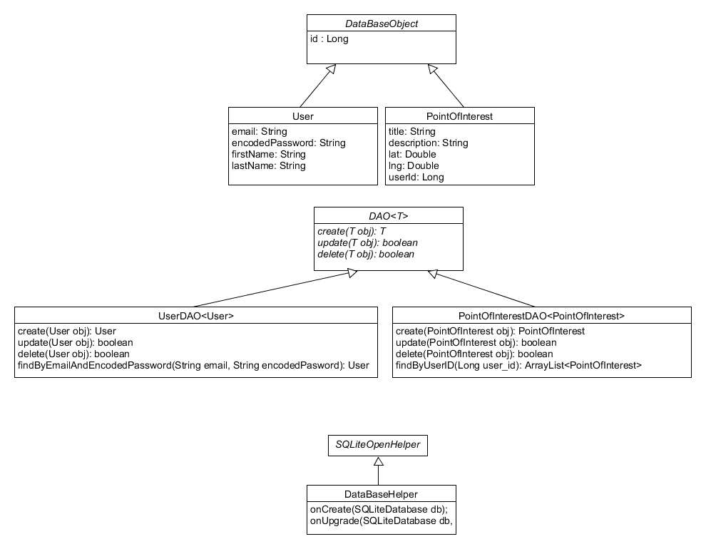
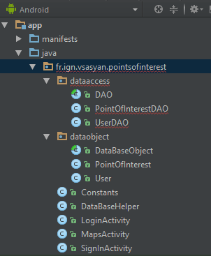
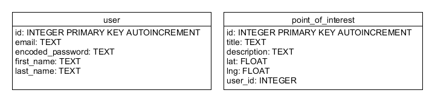
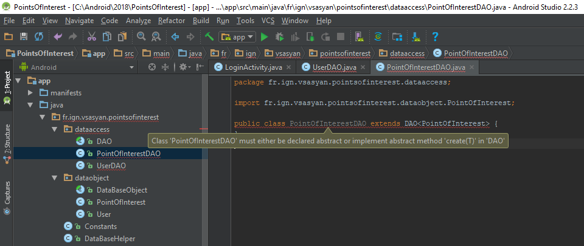
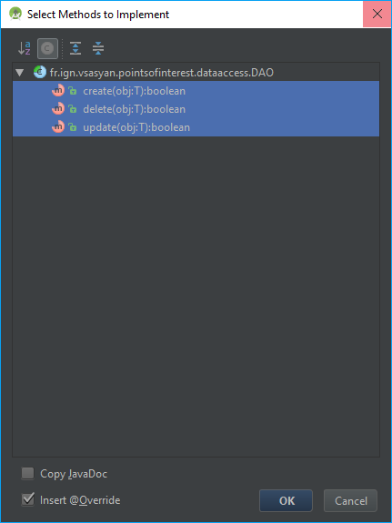
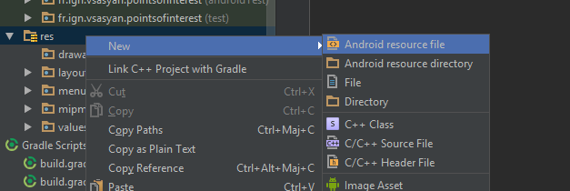
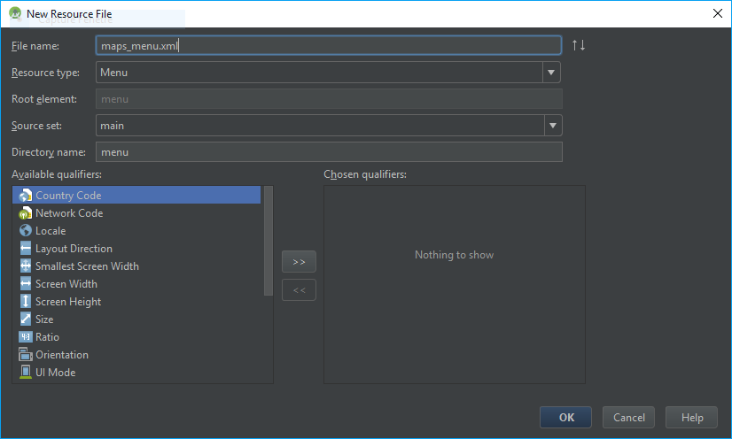

# SQLite

Android permet également de gérer des bases de données en local grâce à SQLite. C'est un SGBD très léger qui n'a pas besoin de serveur : toute la base est simplement stockée dans un fichier.

## Objectifs

Cette partie permet de voir :
* la gestion des bases de données avec Android ;
* comment dissocier les classes java de la gestion des bases de données.

## Le principe de l'application

L'application sera composée d'un écran de connexion (`LoginActivity`), d'un écran d'inscription (`SigninActivity`), d'une carte permettant la visualisation de points d'intérêt (`MapsActivity`) et d'un formulaire pour saisir de nouveaux points (`NewPointActivity`).

## Mise en place

Créer un nouveau projet appelé `PointsOfInterest` avec une première activité vide nommée `LoginActivity`.

Créez ensuite une seconde activité vide nommée `SignInActivity`.

Créer une troisième activité de type carte nommée `MapsActivity`.

Créer enfin une quatrième activité vide nommée `NewPointActivity`.

Le TP étant assez long, vous trouvez dans le dossier [ressources](ressources) de ce TP les codes XML des fichiers `layout` et du fichier `strings.xml`. Cela vous permet de copier-coller l'interface afin de ne pas perde du temps à la faire.

## Pas à pas des modifications

### 1) Partie connexion

#### Events listeners

Ajoutez à la classe `LoginActicity` :
* des attributs pour les composants graphiques à gérer sur cette fenêtre (voir le layout) ;
* une méthode `loadComponents` qui va instancier les composants graphiques en objet java ;
* une méthode `initEventListeners` qui va ajouter les écouteurs d’événements aux composants graphiques
* deux écouteurs d’événement : `b_loginListener` et `b_signInListener`...

Voir rappel si besoin : [Rappel - Les activités](../7_resume#les-activités)

Vous pouvez ajouter 3 fonctions à la classe : `tryLogin`, `openSignInActivity` et `openMapsActivity`.

#### Ouvrir une autre activité

Lorsque l'utilisateur n'a pas de compte il va appuyer sur le bouton "Sign in" pour se connecter.

Il va alors falloir ouvrir l'activité `SignInActivity` qui lui permettra de s'enregistrer.

Pour ouvrir une autre activité, on utilise un Intent, cela permet également de transmettre des informations :

```java
        String email, password;

        // Récupération de l'email et du password
        
        // Create intent
        Intent intent = new Intent(this, SignInActivity.class);

        // Put extra
        intent.putExtra(Constants.EXTRA_EMAIL, email);
        intent.putExtra(Constants.EXTRA_PASSWORD, password);

        // Start activity
        startActivity(intent);
```

On suppose ici qu'on récupère le mail et le mot de passe tapés par l'utilisateur et on les transmet à l'autre activité pour faire gagner du temps à un utilisateur distrait qui aurait déjà tapé ces informations...

Vous pouvez noter que comme dans le TD précédent, nous allons ajouter une classe pour stocker les clés utilisées par les extra. Cela doit être des  `public static String`.

Maintenant, quand notre activité d'inscription s'ouvrir, il faudra qu'elle récupère les informations qui lui ont été transmises :

```java
    // Dans la fonction onCreate
    Intent intent = getIntent();
    if (intent != null) {
        String email = intent.getStringExtra(Constants.EXTRA_EMAIL);
        String password = intent.getStringExtra(Constants.EXTRA_PASSWORD);
    }
```

Ajoutez également les fonctions `loadComponents` et `initEventListeners` sur la classe SignInActivity et des attributs `TextEdit` et `Button` pour les composants graphiques.

On a fait le plus gros du code de base. Il est temps maintenant de s'attaquer à la base de données.

**Avant de passer à l'étape suivante, vérifiez que votre application fonctionne est qu'elle est utilisable (un clic sur `Sign in` doit changer d'activité).**

### 2) Base de données

Java permet, grâce à une parfaite implémentation de tout l'UML que vous connaissez, de faire du code très propres et très réutilisable lors de gestion sauvegarde d’objet. Nous allons pour l'exemple utiliser le pattern DAO (comme « Data Acces Object »).

Le **but** est que *les objets métiers* ne soit **pas dépendants** de *la façons dont sont stockées les données*.

Nous allons avoir les classes suivantes :
* `DataBaseObject` : classe abstraite parent de tous les objets métier (objet métier) ;
* `User` : qui représente un utilisateur (objet métier) ;
* `PointOfInterest : qui représente un point d’intérêt (objet métier) ;
* `DAO<T>` : classe abstraite générique (stockage des données) ;
* `UserDAO<User>` : classe gérant le stockage des utilisateurs (stockage des données) ;
* `PointOfInterestDAO<PointOfInterest>` : classe gérant le stockage des points d'intérêt (stockage des données) ;
* `DataBaseHelper` : classe d'accès à la base (propre à Android).

Voici le schéma UML d'illustration :



#### a) Création des classes vides

Commencez par créer deux packages : `dataaccess` et `dataobject`. Ils regroupent respectivement tout ce qui touche au stockage (accès) des données et tout ce qui touche aux objets métier.

Créer les classes vides dans un premier temps :



#### b) Classes métier

Ensuite ajoutez les attributs (en `private`) aux classes métier :

```java
package fr.ign.vsasyan.pointsofinterest.dataobject;

public abstract class DataBaseObject implements Serializable {
    protected Long id;

    DataBaseObject() {} // Default constructor
}
```

```java
package fr.ign.vsasyan.pointsofinterest.dataobject;

public class PointOfInterest extends DataBaseObject {
    private String title;
    private String description;
    private Double lat;
    private Double lng;
    private Long userId;

    // Constructor
    public PointOfInterest(String title, String description, Double lat, Double lng, Long userId) {
        setTitle(title);
        setDescription(description);
        setLat(lat);
        setLng(lng);
        setUserId(userId);
    }
}

```

```java
package fr.ign.vsasyan.pointsofinterest.dataobject;

public class User extends DataBaseObject {
    private String email;
    private String encodedPassword;
    private String firstName;
    private String lastName;

    // Constructor
    public User(String email, String encodedPassword, String firstName, String lastName) {
        setEmail(email);
        setEncodedPassword(encodedPassword);
        setFirstName(firstName);
        setLastName(lastName);
    }
}
```

Vous pouvez à ce moment générer simplement les « getteur » et les « setteur » en faisant `Alt+Inser` ou en cliquant dans le menu « Code => Generate... ».

Nous avons terminé la partie métier.

#### c) Classes DataBaseHelper

Cette classe permet d’initialiser la création de la base de données. Elle va également permet de tenir le schéma à jour lorsqu'il y a des modifications.

Voici le code de base à utiliser :

```java
public class DataBaseHelper extends SQLiteOpenHelper {

    // If you change the database schema, you must increment the database version.
    public static final int DATABASE_VERSION = 1;
    public static final String DATABASE_NAME = "points_of_interest.db";

    // Sql commands
    private String SQL_CREATE_USER = "";
    private String SQL_CREATE_POINT_OF_INTEREST = "";
    private String SQL_DELETE_USER = "DROP TABLE IF EXISTS user;";
    private String SQL_DELETE_POINT_OF_INTEREST = "DROP TABLE IF EXISTS point_of_interest;";

    public DataBaseHelper(Context context) {
        super(context, DATABASE_NAME, null, DATABASE_VERSION);
    }
    public void onCreate(SQLiteDatabase db) {
        db.execSQL(SQL_CREATE_USER);
        db.execSQL(SQL_CREATE_POINT_OF_INTEREST);
        // Pour le début, ajoute des poi au premier utilisateur...
        db.execSQL("INSERT INTO point_of_interest(title, description, lat, lng, user_id) VALUES ('ENSG', '', 48.8410201, 2.5872416, 1);");
        db.execSQL("INSERT INTO point_of_interest(title, description, lat, lng, user_id) VALUES ('Ecole des ponts', '', 48.8410536, 2.587911, 1);");
        db.execSQL("INSERT INTO point_of_interest(title, description, lat, lng, user_id) VALUES ('IFTAR', '', 48.8423652, 2.5874393, 1);");
    }
    public void onUpgrade(SQLiteDatabase db, int oldVersion, int newVersion) {
        db.execSQL(SQL_DELETE_USER);
        db.execSQL(SQL_DELETE_POINT_OF_INTEREST);
        onCreate(db);
    }

}
```

Comme vous pouvez le voir, il y a un attribut `DATABASE_VERSION` qui donne la version du schéma de la base, pensez à l'augmenter de 1 à chaque fois que vous modifiez la structure du schéma SQL.

Puis des fonctions :
* `onCreate` : elle est exécutée la première fois que l'utilisateur lance votre application, elle doit créer la base ;
* `onUpgrade` : elle est exécutée lorsque l'utilisateur relance votre application après une mise à jour de la base. `oldVersion` va donner la valeur de `DATABASE_VERSION` de l'ancienne version et `newVersion` la nouvelle valeur de `DATABASE_VERSION`. Il va alors falloir mettre à jour le schéma. Dans notre exemple, nous détruisons simplement la base et la reconstruisons depuis le début (perte des données).

Modifier la commande de création pour créer vos tables SQL, voici le schéma attendu de la base :



#### d) Classes DAO

Les classes DAO sont les classes qui permettent de modifier les données dans la base, on va donc implémenter au minimum les fonctions suivantes :
* `create` ;
* `update` ;
* `delete`.

On peut donc ajouter ces méthodes à la classes abstraite DAO :

```java
public abstract class DAO<T> {
    protected SQLiteDatabase db;

    public DAO(SQLiteDatabase db) {
        this.db = db;
    }

    /**
     * Save given obj in database
     * @param obj
     * @return
     */
    public abstract T create(T obj);

    /**
     * Update given obj in database
     * @param obj
     * @return
     */
    public abstract boolean update(T obj);

    /**
     * Delete given obj of database
     * @param obj
     * @return
     */
    public abstract boolean delete(T obj);
}
```

Nous ajoutons aussi un attribut `SQLiteDatabase db;` qui représente la base de données et un constructeur.

Vous pouvez maintenant ouvrir les autres classes de DAO. Nous allons les modifier en disant qu'elle sont des spécialisations de la classe DAO appliquées à des classes en particulier.

UserDAO est une spécialisation de DAO<T> appliquée à la classe User :

```java
public class UserDAO extends DAO<User> {
}
```

PointOfInterestDAO est une spécialisation de DAO<T> appliquée à la classe PointOfInterest :

```java
public class PointOfInterestDAO extends DAO<PointOfInterest> {
}
```

Les deux classes sont toujours soulignées en rouge. C'est normal : il manque les fonctions de base déclarées dans la classe DAO :



Il suffit de faire `Alt+Inser` et de choisir « Implements methods » pour qu'Android Studio vous propose les méthodes à implémenter :



Elles sont toutes sélectionnées par défaut car toutes obligatoires : notre classe hérite de la classe abstraite `DAO` et doit donc en implémenter toutes les méthodes abstraite.

Recommençons avec le constructeur : `Alt+Inser` => « Constructor ».

Voici les deux classes complétées :

```java
public class UserDAO extends DAO<User> {

    public UserDAO(SQLiteDatabase db) {
        super(db);
    }

    @Override
    public User create(User obj) {
        return null;
    }

    @Override
    public boolean delete(User obj) {
        return false;
    }

    @Override
    public boolean update(User obj) {
        return false;
    }
}
```

```java
public class PointOfInterestDAO extends DAO<PointOfInterest> {
    
    public PointOfInterestDAO(SQLiteDatabase db) {
        super(db);
    }

    @Override
    public PointOfInterest create(PointOfInterest obj) {
        return null;
    }

    @Override
    public boolean delete(PointOfInterest obj) {
        return false;
    }

    @Override
    public boolean update(PointOfInterest obj) {
        return false;
    }
}
```


Pour le moment elles ne font rien !

Il va falloir agir sur l'attribut db pour accéder à la base :

```java
    public User create(User obj) {
        ContentValues values = new ContentValues();
        values.put("email", obj.getEmail());
        values.put("encoded_password", obj.getEncodedPassword());
        values.put("first_name", obj.getFirstName());
        values.put("last_name", obj.getLastName());

        Long id = db.insert("user", null, values);

        obj.setId(id);

        return obj;
    }
```

```java
    public boolean update(User obj) {
        ContentValues values = new ContentValues();
        values.put("email", obj.getEmail());
        values.put("encoded_password", obj.getEncodedPassword());
        values.put("first_name", obj.getFirstName());
        values.put("last_name", obj.getLastName());

        // Which row to update, based on the title
        String selection = " id LIKE ?";
        String[] selectionArgs = { obj.getId().toString() };

        int count = db.update("user", values, selection, selectionArgs);

        return count == 1;
    }
```

```java
    public boolean delete(User obj) {
        // Define 'where' part of query.
        String selection = "id = ?";
        // Specify arguments in placeholder order.
        String[] selectionArgs = { obj.getId().toString() };
        // Issue SQL statement.
        int count = db.delete("user", selection, selectionArgs);

        return count == 1;
    }
```

```java
    public User findByEmailAndEncodedPassword(String email, String encodesPassword) {
        String[] columns = { "id", "email", "encoded_password", "first_name", "last_name" };

        String selection = "email = ? AND encoded_password = ?";
        String[] selectionArgs = { email, encodesPassword };

        Cursor cursor = db.query(
            "user",                     // The table to query
            columns,                    // The columns to return
            selection,                  // The columns for the WHERE clause
            selectionArgs,              // The values for the WHERE clause
            null,                       // don't group the rows
            null,                       // don't filter by row groups
            null                        // don't sort order
        );

        if (cursor.moveToFirst()) {
            return new User(cursor);
        }

        return null;
    }
```

Nous allons ajouter un constructeur pour User à base d'un `cursor` :

```java
    public User(Cursor cursor) {
        super(cursor);
        setEmail(cursor.getString(cursor.getColumnIndex("email")));
        setEncodedPassword(cursor.getString(cursor.getColumnIndex("encoded_password")));
        setFirstName(cursor.getString(cursor.getColumnIndex("first_name")));
        setLastName(cursor.getString(cursor.getColumnIndex("last_name")));
    }
```

Et ajouter le constructeur dans la classe parente (`DataBaseObject`) :

```java
    DataBaseObject(Cursor cursor) {
        setId(cursor.getLong(cursor.getColumnIndex("id")));
    }
```

Vous pouvez compléter de même ce qui concerne les points d’intérêt, avec cette fois-ci une fonction `ArrayList<PointOfInterest> findByUserId(Long user_id)`.

### 3) Utilisation de la base de données

Au démarrage des activités, nous allons :
* instancier le `DataBaseHelper`,
* récupérer l'objet `SQLiteDatabase`,
* récupérer les DAO.

````java
        DataBaseHelper dataBaseHelper = new DataBaseHelper(this);
        db = dataBaseHelper.getWritableDatabase();
        userDAO = new UserDAO(db);
        pointOfInterestDAO = new PointOfInterestDAO(db);
```

Ici les variables : `db`, `userDAO` et `pointOfInterestDAO` sont des attributs de classe :

```java
    SQLiteDatabase db;
    UserDAO userDAO;
    PointOfInterestDAO pointOfInterestDAO;
```

#### a) Login

Dans la fonction `tryLogin`, il suffit de récupérer les données entrées par l'utilisateur et d'utiliser le DAO :

```java
    public void tryLogin() {
        String email, password;
        email = et_email.getText().toString();
        password = et_password.getText().toString();

        User user = userDAO.findByEmailAndEncodedPassword(email, password);

        if (user != null) {
            openMapsActivity(user);
        } else {
            Toast.makeText(this, "Email or password not correct.", Toast.LENGTH_SHORT).show();
        }
    }
```

Il faut créer une fonction `openMapsActivity(User user)` qui ouvre l'activité carte et affiche les points d'intérêt de l'utilisateur. Passez l’utilisateur en extra de l'intent.

Vous pouvez mettre et récupérer n'importe quel objet `Serializable` dans les extra d'un intent :

```java
    // Put
    intent.putExtra(Constants.EXTRA_USER, user);
    // Get
    user = (User)intent.getSerializableExtra(Constants.EXTRA_USER);
```

Note : nos `User` sont bien `Serializable` car ils héritent de la classe `DataBaseObject` qui `implements Serializable`...

#### b) Signin

Complétez la fonction pour s'inscrire.

#### c) Activité de carte

Fonctionnalités :
* récupérer les points d'intérêt de l’utilisateur ;
* afficher les points sur la carte ;
* localiser l’utilisateur en arrière plan et lui permettre de saisir des points d'intérêt géolocalisés.

Pour permettre à l'utilisateur d'ajouter des points d'intérêt, il va falloir ajouter un menu avec un item « Ajouter un point d'intérêt ».

Modifier la classe parent de votre activité pour `AppCompatActivity` :

```java
public class MapsActivity extends AppCompatActivity implements OnMapReadyCallback {
    // ...
}
```

Ajouter une méthode `onCreateOptionsMenu` pour charger les item du menu à la création de l'activité :

```java
    @Override
    public boolean onCreateOptionsMenu(Menu menu) {
        // Inflate the menu; this adds items to the action bar if it is present.
        getMenuInflater().inflate(R.menu.maps_menu, menu);
        return super.onCreateOptionsMenu(menu);
    }
```

Ajouter une fonction `onOptionsItemSelected` qui sera exécutée lors du clic sur un item du menu :

```java
    @Override
    public boolean onOptionsItemSelected(MenuItem item) {
        int id = item.getItemId();

        if (id == R.id.menu_item_add_point) {
            openAddPointActivity();
        }

        return super.onOptionsItemSelected(item);
    }
```

Il faut enfin ajouter un fichier XML pour décrire le menu. Faites un clic-droit sur `res` puis `New => Android ressource file` :



Pour demandez un menu, nommé `maps_menu.xml` :



Voici le code XML à utiliser :

```xml
<?xml version="1.0" encoding="utf-8"?>
<menu xmlns:android="http://schemas.android.com/apk/res/android">
    <item android:id="@+id/menu_item_add_point"
        android:title="@string/add_point"/>
</menu>
```

L'idée est de transmettre ensuite la position de l'utilisateur et l'objet user à l'`AddPoinActivity` qui présente à l'utilisateur le formulaire.

Le géo-positionnement se ferait donc dans la `MapsActivity` (par exemple).

## Les points à retenir

Les `Intent` permettent également de démarrer une nouvelles activité en leur transmettant des données.

La classe DataBaseHelper permet de créer le schéma de votre base de donnée et de le tenir à jour.

Les `design pattern` permettent de mieux organiser votre code.

## Projet complet

Vous pouvez retrouver le projet complet ici : [https://gitlab.com/vsasyan/PointsOfInterest ](https://gitlab.com/vsasyan/PointsOfInterest )

## Plus de détails sur...

* La gestion des base de données : [Saving Data Using SQLite](https://developer.android.com/training/data-storage/sqlite.html)
* Le design pattern DAO en java : [Lier ses tables avec des objets Java : le pattern DAO](https://openclassrooms.com/courses/apprenez-a-programmer-en-java/lier-ses-tables-avec-des-objets-java-le-pattern-dao)