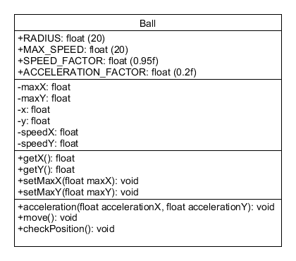
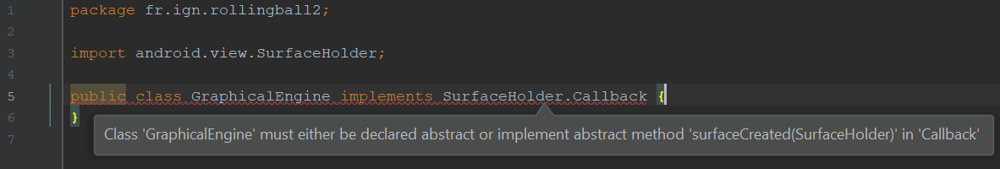

# Les Capteurs

Utiliser des capteurs du téléphone.

## Objectif

L'objectif de cette partie est de voir comment récupérer les données fournies par les différents capteurs du téléphones.

## Le principe de l'application

L'application sera composée d'une vue permettant d'afficher une balle se déplaçant selon l'inclinaison du téléphone.

## Mise en place

Créez un nouveau projet nommé `RollingBall` composé d'une activité vide « Empty Activity ».

Dans la vue, supprimer le `TextView` et ajoutez à la place une `SurfaceView` (définissez sa `layout_width` et sa `layout_height` sur `match_parent`).

Dans le fichier `AndroidManifest.xml`, ajoutez la balise `uses-feature` ci-dessous pour demander l'autorisation d'accéder aux données fournies par l'accéléromètre :

```xml
<?xml version="1.0" encoding="utf-8"?>
<manifest xmlns:android="http://schemas.android.com/apk/res/android"
    package="fr.ign.rollingball">

    <uses-feature android:name="android.hardware.sensor.accelerometer"
        android:required="true" />
        
    <!-- ... -->

</manifest>
```

Ajoutez également un attribut `android:screenOrientation` valant `portrait` à la balise `activity` pour bloquer sa rotation.

Créer deux 3 classes pour le moment vides :

* `PhysicalEngine` : pour gérer la physique du projet ;
* `GraphicalEngine` pour gérer l'affichage du projet ;
* `Ball` : pour représenter la balle.

Ces classes seront instanciées dans la fonction `onCreate` de votre activité et les deux moteurs (graphique et physique) seront stockés dans des attributs de classe.


## Accéder aux informations du capteur

Ces modifications concernent le moteur physique (classe `PhysicalEngine`).

### Présentations

Pour accéder aux données, nous auront besoin de trois objets :

* un `SensorManager` : qui permet de récupérer les différents capteurs ;
* un `Sensor` : qui représente un capteur (pour nous l'accéléromètre) ;
* un `SensorEventListener` : pour déclencher des actions suite à des événements.

Ajoutez comme attributs de classe un `SensorManager sensorManager` et un `Sensor accelerometer`.

### Mise en place

#### Récupération du capteur

Le code suivant permet de récupérer le gestionnaire de capteurs et l'accéléromètre :

```java
sensorManager = (SensorManager)activity.getSystemService(Context.SENSOR_SERVICE);
accelerometer = sensorManager.getDefaultSensor(Sensor.TYPE_ACCELEROMETER);
```

Il sera exécuté dans le *constructeur* du moteur physique.

Le constructeur prendra en paramètre une activité et une balle :

```java
public class PhysicalEngine { 
    
    // ...

    PhysicalEngine(Activity activity, Ball ball) {
        // ...
    }
}
```

Stockez également l'objet `Ball` dans un attribut de la classe.

#### Déclaration de l'écouteur d'événement

Nous auront en suite besoin d'un écouteur d'événement.

Cet écouteur sera un *attribut de la classe*, il va appeler une fonction `protected void moveBall(float accelerationX, float accelerationY)` que nous compléterons plus tard.

```java
    final SensorEventListener sensorEventListener = new SensorEventListener() {
        public void onAccuracyChanged(Sensor sensor, int accuracy) {
        }

        public void onSensorChanged(SensorEvent sensorEvent) {
            float accelerationX = -sensorEvent.values[0];
            float accelerationY = sensorEvent.values[1];
            PhysicalEngine.this.moveBall(accelerationX, accelerationY);
        }
    };
```

#### Inscription/désinscription de l'écouteur d'événement

Quand l'*activité est active*, nous auront besoin d'inscrire l'écouteur d'événement.

Quand l'*activité est mise en pause*, nous auront besoin de désinscrire l'écouteur d'événement.

Pour cela nous allons utiliser les fonctions [registerListener](https://developer.android.com/reference/android/hardware/SensorManager.html#registerListener(android.hardware.SensorEventListener,%20android.hardware.Sensor,%20int)) et [unregisterListener](https://developer.android.com/reference/android/hardware/SensorManager.html#unregisterListener(android.hardware.SensorEventListener,%20android.hardware.Sensor)) de notre [sensorManager](https://developer.android.com/reference/android/hardware/SensorManager.html).

Nous auront également besoin notre écouteur d'événement `sensorEventListener`, de notre capteur `accelerometer` et d'une fréquence de rafraîchissement (par exemple `SensorManager.SENSOR_DELAY_GAME`).

Créez les fonctions :

* `void startEngine()` : inscription de l'écouteur d'événement ;
* `void stopEngine()` : désinscription de l'écouteur d'événement ;

Ces fonctions devront être appelées depuis un *emplacement adéquat* de votre activité.

### Test

A ce stade, ajoutez une ligne de log dans la fonction `moveBall` :

```java

public class PhysicalEngine {

    // ...

    private void moveBall(float accelerationX, float accelerationY) {
        Log.i("ENSG", String.format("moveBall %f %f", accelerationX, accelerationY));
    }

    // ...
}
```

Lancez l'application et regardez le logcat...

On ne récupère pas l'axe Z, donc si vous posez votre téléphone sur la table les deux valeurs doivent être proches de 0. Si vous tournez le téléphone (pour aligner l'axe X ou l'axe Y sur l'axe Z), la valeur de l'accélération doit vous rappeler quelque chose.

## La balle

Complétez la classe Ball selon l'UML suivant :



Fonction :

* `acceleration` : met à jour les vitesses (pondérées par `ACCELERATION_FACTOR`) ;
* `move` : met à jour les positions et appelle `checkPosition` ;
* `checkPosition` : si la balle doit sortir du cadre, elle rebondit.


## Affichage de la balle

Ces modifications concernent le moteur graphique (classe `GraphicalEngine`).

### SurfaceView

L'affichage de la balle se fera sur le `SurfaceView`.

Cet élément nous fournira un objet de type `SurfaceHolder`. C'est à cet élément qu'il faudra lier notre moteur graphique.

Notre moteur graphique doit implémenter l'interface `SurfaceHolder.Callback` : complétez sa déclaration.

AndroidStudio doit vous afficher un message d'erreur :



Ajoutez les fonctions requises par l'interface `SurfaceHolder.Callback` (`<Ctrl>` + `I`).

Créez un constructeur `GraphicalEngine(Ball ball)` prenant en paramètre une balle qui est stockée dans un attribut de classe.

Dans la fonction `onCreate` de l'activité :

1. ajoutez un code pour instancier la `SurfaceView` en object Java ;
2. instanciez votre moteur graphique ;
3. associez le moteur graphique à la SurfaceView :

```java
surfaceView.getHolder().addCallback(graphicalEngine);
```

### GraphicalEngine

#### Callback

Maintenant, il faut compléter les 3 fonctions de callback de notre moteur graphique (`surfaceCreated`, `surfaceChanged` et `surfaceDestroyed`).

Quand la surface est :

* créé : il faut stocker la variable passée en paramètre dans une variable de classe `surfaceHolder` puis créer et lancer un thread (voir point suivant, ajoutez juste un commentaire pour le moment) ;
* détruite : il faut interrompre le thread (voir point suivant, ajoutez juste un commentaire pour le moment) et définir comme égale à `null` notre variable de classe `surfaceHolder` ;
* changée : il faut mettre à jour la variable de classe `surfaceHolder`, mettre à jour les attributs `maxX` et `maxY` de notre balle (grâce à `i1` et `i2`, respectivement) et vérifier la position de la balle.

#### Thread

Pour ne pas bloquer l'interface, nous allons dessiner grâce à un thread séparé.

Le thread ne dessinera que si l'attribut `SurfaceHolder surfaceHolder` du moteur graphique est non null.

Complétez la fonction `surfaceCreated` avec le code suivant :

```java
public class GraphicalEngine implements SurfaceHolder.Callback {

    // ...

    private Thread drawingThread;

    // ...

    @Override
    public void surfaceCreated(SurfaceHolder surfaceHolder) {

        // ...

        drawingThread = new Thread() {
            @Override
            public void run() {

                Canvas canvas;

                while (!isInterrupted()) {
                    try {
                        canvas = GraphicalEngine.this.surfaceHolder.lockCanvas();
                        if (canvas != null) {
                            GraphicalEngine.this.draw(canvas);
                            GraphicalEngine.this.surfaceHolder.unlockCanvasAndPost(canvas);
                        }
                    } catch (NullPointerException e) {}

                    try {
                        Thread.sleep(20);
                    } catch (InterruptedException e) {}
                }
            }
        };
        drawingThread.start();
    }
}
```

Complétez également la fonction `surfaceDestroyed` avec le code d'interruption du thread : `drawingThread.interrupt();`.

Créez également la méthode `private void draw(Canvas canvas)`.

Le thread tente de verrouiller le canevas (`Canvas`) de la surface.

S'il arrive à le verrouiller (`canevas != null`), il peut dessiner dessus. Il appelle alors la fonction `draw`.

Enfin, le thread libère le canevas et patiente un peu...

#### Dessin

Complétez le code de la fonction `draw` :

* la fonction [drawColor](https://developer.android.com/reference/android/graphics/Canvas#drawColor(long,%20android.graphics.BlendMode)) permet de colorier tout le `Canvas` ;
* la fonction [drawCircle](https://developer.android.com/reference/android/graphics/Canvas.html#drawCircle(float,%20float,%20float,%20android.graphics.Paint)) permet de déssiner un cercle sur le `Canvas`.

Il faudra utiliser un objet [Paint](https://developer.android.com/reference/android/graphics/Paint.html) :

```java
Paint paint = new Paint();
paint.setColor(Color.RED);
```

### Lancez l'application !

Normalement l'application devrait fonctionner, et la balle devrait rouler...

## Les points à retenir

On doit utiliser le `SensorManager` pour accéder aux capteurs du téléphone.

Cela demande d'ajouter une autorisation dans le fichier `AndroidManifest.xml`.

Il faut encore utiliser un écouteur d'événement pour récupérer l'information.

## Projet complet

Vous pouvez retrouver le projet complet ici : [https://gitlab.com/vsasyan/AndroidENSG-codes/tree/master/RollingBall](https://gitlab.com/vsasyan/AndroidENSG-codes/tree/master/RollingBall)
