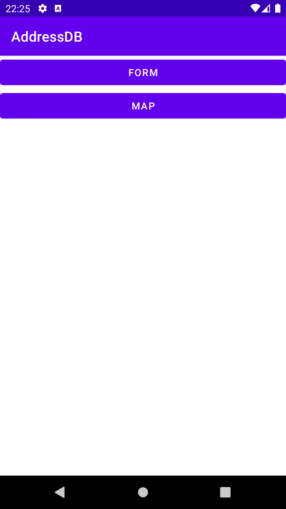
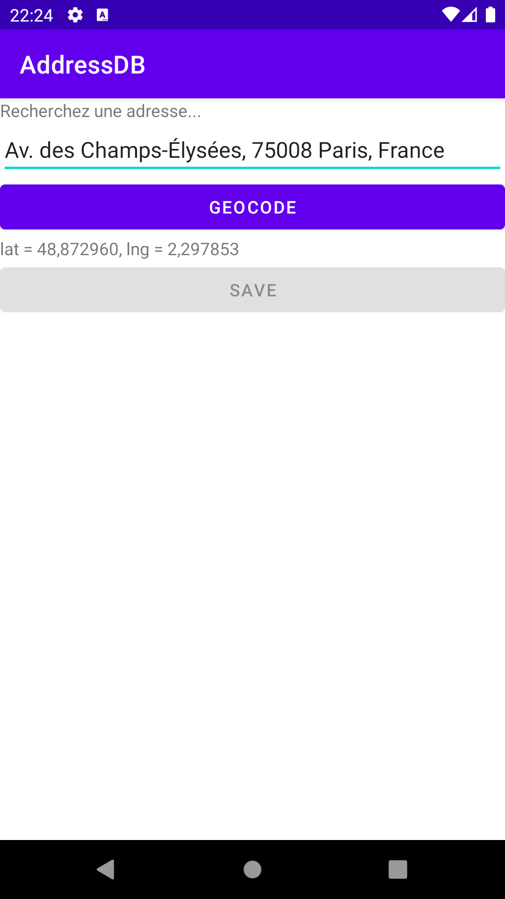
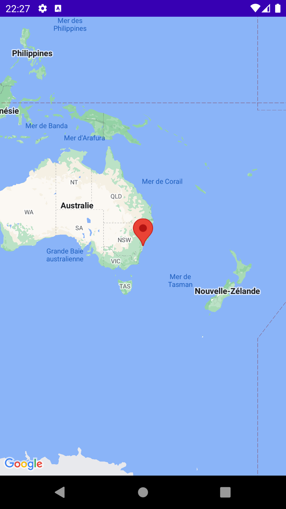
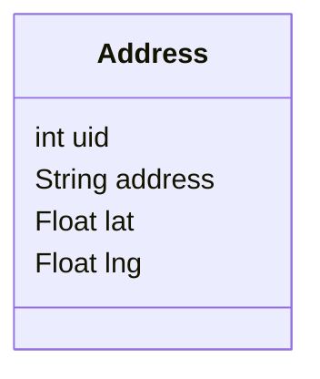
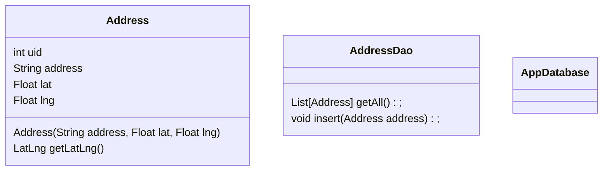

# SQLite

Android permet également de gérer des bases de données en local grâce à SQLite. C'est un SGBD très léger qui n'a pas besoin de serveur : toute la base est simplement stockée dans un fichier.

## Objectifs

Cette partie permet de voir :
* la gestion des bases de données avec Android ;
* comment dissocier les classes java de la gestion des bases de données.

## Le principe de l'application

L'application sera composée d'un écran de connexion (`LoginActivity`), d'un écran d'inscription (`SigninActivity`), d'une carte permettant la visualisation de points d'intérêt (`MapsActivity`) et d'un formulaire pour saisir de nouveaux points (`NewPointActivity`).

## Mise en place

Créer un nouveau projet appelé `AddressDB` avec une première **activité vide** nommée `MainActivity`.

Créer une deuxième **activité de type carte** nommée `MapsActivity`.

Créer enfin une troisième **activité vide** nommée `FormActivity`.

## Pas à pas des modifications

### 1) Interface

#### MainActivity

La première activité doit afficher 2 boutons permettant d'ouvrir les autres activités.

Ajouter donc 2 boutons, avec un `id` et un `text` adaptés et associez leur des écouteurs d'événement.



Pour ouvrir une autre activité, on utilise un `Intent` (avec ou sans transmission d'information) :

```java
    // Ceci est un code d'exemple à adapter !!!
    private void openOtherActivity() {
        // Création de l'intent lié à l'activité à ouvrir
        Intent intent = new Intent(this, OtherActivity.class);
        // Ajout de clef/valeur si besoin
        intent.putExtra("KEY", "VALUE");
        // Lancement de l'activité
        startActivity(intent);
    }
```

Voir rappel si besoin : [Rappel - Les activités](../7_resume#les-activités)


#### FormActivity

La `FormActivity` doit afficher un formulaire permettant à un utilisateur de rentrer une adresse postale puis de cliquer sur un bouton pour la géocoder.

Suite au géocodage, l'utilisateur doit voir l'adresse officielle et la position récupérée et un bouton de sauvegarde doit être rendu cliquable.

Pour le moment, on ne peut pas encore enregistrer les info...



#### MapsActivity

La vue carte doit afficher une carte centrée sur l'ENSG.

Pensez à ajouter la clef pour voir la carte (cf. formationTemp).



### 2) Base de données

Pour gérer la base, nous allons utiliser un [ORM](https://fr.wikipedia.org/wiki/Mapping_objet-relationnel).

Les ORM sont des outils permettant de faire le lien entre une classe (dans un language de programmation donné) et sa représentation dans une base de donnée.

On peut par exemple citer `doctrine` pour PHP ou `sqlalchemy` pour Python. C'est très pratique, très puissant et en général ils gèrent plusieurs types de bases de données.

Généralement, on ajoute des [annotations](https://fr.wikipedia.org/wiki/Annotation_(informatique)) autour de notre code (Java) afin de décrire comment on veut l'enregistrer en base.

#### a) Importation de Room

Room est l'ORM de Google pour utiliser les BDD en Android.

Pour installer Room, il faut ajouter les dépendances dans le fichier `build.graddle` du **module** :

```groovy
dependencies {
    def room_version = "2.5.0"
    implementation "androidx.room:room-runtime:$room_version"
    annotationProcessor "androidx.room:room-compiler:$room_version"

    // Autres dépendances...
}
```

**PENSEZ A SYNCHRONISER GRADLE !!!**

Vous retrouvez un tuto sur Room fait par Google ici : https://developer.android.com/training/data-storage/room?hl=fr#java

#### b) Création des classes vides

Dans notre cas, nous souhaitons enregistrer une classe `Address` avec les attributs suivants :



Il faudra créer :
* une classe pour l'entité `Address` (notre classe métier, le [PoJo](https://fr.wikipedia.org/wiki/Plain_old_Java_object)) ;
* une classe pour le DAO `AddressDao` (la classe qui va s'occuper du lien avec la BDD) ;
* une classe pour gérer la BDD `AppDatabase`.

Voici le diagramme de classe complet :



#### c) Ajout des annotations

On va regarder et adapter le [tuto](https://developer.android.com/training/data-storage/room?hl=fr#java) pour annoter les classes...

#### d) Classe AppDatabase

Cette classe permet d’initialiser la création de la base de données. Elle va également permet de tenir le schéma à jour lorsque il y a des modifications.

C'est à vous d'incrémenter l'annotation `version` quand vous modifiez la structure de la base pour qu'elle soit réinitialisée.

Pour accéder à la base, il faut instancier dans un contrôleur la classe `AppDatabase` et utiliser le getter pour récupérer un DAO.

```js
    @Override
    protected void onCreate(Bundle savedInstanceState) {
        // ...
        // Récupération db
        AppDatabase db = Room.databaseBuilder(getApplicationContext(), AppDatabase.class, "database-name")
            .allowMainThreadQueries()
            .fallbackToDestructiveMigration()
            .build();
        // Récupération DAO (à mettre en attribut de classe si utilisé ailleurs...)
        AddressDAO addressDAO = db.addressDao();
    }
```

Exemple d'utilisation :

```java
// Ajout d'une entité
Address address = new Address("adresse", 42.0f, 3.0f);
addressDAO.insert(address);
// Listing des entités
List<Address> addresses = addressDAO
// Log (implémentez la fonction toString !!!)
Log.i("ENSG", addresses.toString());
```

Le `.fallbackToDestructiveMigration()` permet de supprimer la base en cas de changement de version. Normalement vous devriez implémenter un code propre permettant de migrer le schéma de la base (par exemple ajouter les colonnes manquantes).

Lancez l'application plusieurs fois. Vous devriez voir le nombre d'adresses récupérées augmenter.

Augmentez la version, vous devriez alors n'avoir plus qu'une adresse. La base a été réinitialisée.

Vous pouvez récupérer le fichier de la BDD via le Device File Explorer en bas à droite. Chez moi, le fichier a l'adresse /data/data/fr.ign.addressdb/databases/database-name`.

Une fois récupéré, vous pouvez l'ouvrir via un logiciel gérant le SQLite, par exemple ce site : https://sqliteonline.com/

### 3) La suite de l'application

Implémentez le code pour gérer l'activité de formulaire :
* complétion de l'adresse via Geocoder ;
* sauvegarde dans la base de donnée.

Implémentez en suite le code pour afficher la carte :
* récupérez les entités en base et affichez les ;
* afficher l'emprise globale des points pour optimiser la vue ;
* affichez l'adresse de chaque point dans le title du marqueur.


## Les points à retenir

Les `Intent` permettent de démarrer une nouvelle activité en lui transmettant des données.

La classe `AppDatabase` permet de créer le schéma de votre base de donnée et de le tenir à jour.

**Les ORM sont des outils vraiment géniaux !**

## Jamais fini !

Vous pouvez ajouter une activité pour visualiser/éditer un point après avoir cliqué dessus sur la carte...

## Projet complet

Vous pouvez retrouver le projet complet ici (à venir) : [https://gitlab.com/vsasyan/AddressDB ](https://gitlab.com/vsasyan/AddressDB )
