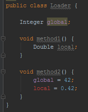

# Résume

## Généralités

Un projet Android est principalement composé de 2 types de fichiers :
* les ressources ;
* les classes Java (*UNE classe dans UN fichier*).

### Les ressources

Elle sont dans le dossier "\res" et permettent de transférer de l'information à votre application. En particulier :
* les constantes (dossier "\res\values") que ce soient des chaînes de caractères, des couleurs, etc ;
* les vues (dossier "\res\layout") ;
* les images (dossier "\res\drawable").

### Les classes java

C'est le cœur de votre application, il y en a deux types à distinguer :
* les activités : ce sont des classes spécialisées qui permettent de faire le lien avec les vues ;
* les autres : toute classe Java permettant de traiter et de gérer la donnée.

## Organisation du code

### Les ressources « string »

Elles sont déclarées dans le fichier "\res\values\string.xml" :

```xml
<resources>
    <string name="app_name" translatable="false">Résumé</string>
    <string name="welcome">Bienvenue !</string>
    <string name="ask_day">Quel jour sommes-nous ?</string>
    <string name="today">Nous somme le %d du mois...</string>
</resources>
```

On peut y accéder depuis :
* une autre ressource : `@string/welcome` ;
* une classe java : `getString(R.string.welcome)`;

### Les ressources « vue »

Elles sont déclarées dans le dossier "\res\layout\" : il y a un fichier par vue.

Conseil :
* pensez à bien nommer vos composants pour y accéder plus facilement ensuite ;
* les `LinearLayout` sont un bon moyen de positionner simplement vos composants : ils juxtaposent les composants (verticalement `android:orientation="vertical"` ou horizontalement `android:orientation="horizontal"`).

Exemple :
```xml
<?xml version="1.0" encoding="utf-8"?>
<RelativeLayout xmlns:android="http://schemas.android.com/apk/res/android"
    xmlns:tools="http://schemas.android.com/tools"
    android:id="@+id/activity_main"
    android:layout_width="match_parent"
    android:layout_height="match_parent"
    android:paddingBottom="@dimen/activity_vertical_margin"
    android:paddingLeft="@dimen/activity_horizontal_margin"
    android:paddingRight="@dimen/activity_horizontal_margin"
    android:paddingTop="@dimen/activity_vertical_margin"
    tools:context="fr.ign.sasyan.resume.MainActivity">

    <LinearLayout
        android:orientation="vertical"
        android:layout_width="match_parent"
        android:layout_height="match_parent"
        android:layout_alignParentTop="true"
        android:layout_alignParentLeft="true"
        android:layout_alignParentStart="true">

        <TextView
            android:layout_width="wrap_content"
            android:layout_height="wrap_content"
            android:text="@string/welcome"
            android:layout_gravity="center" />

        <Button
            android:id="@+id/ask_day"
            android:text="@string/ask_day"
            android:layout_width="wrap_content"
            android:layout_height="wrap_content"
            android:layout_gravity="center" />

        <TextView
            android:id="@+id/show_day"
            android:layout_width="wrap_content"
            android:layout_height="wrap_content"
            android:text="" />

    </LinearLayout>
</RelativeLayout>
```

### Les activités

Ce sont des classes Java classiques mais elles permettent en plus de gérer l'interface avec l'utilisateur. Pour cela, vous devrez instancier les composants en objets Java.

Je vous conseil de **toujours** utiliser cette structure :

```java
public class MainActivity extends AppCompatActivity {

    /**
     * Déclaration des objets Java représentant les composants graphiques
     * (en attributs de la classe, ils sont donc accessibles depuis toutes les méthodes)
     */
    Button askDay;
    TextView showDay;

    /**
     * Fonction exécutée à la création de la vue
     * Elle DOIT instancier les objets Java représentant les composants
     * graphiques ET leur ajouter des écouteurs d'événements si besoin.
     */
    @Override
    protected void onCreate(Bundle savedInstanceState) {
        super.onCreate(savedInstanceState);
        setContentView(R.layout.activity_main);

        // I - Instanciation les objets Java représentant les composants graphiques
        askDay = (Button)findViewById(R.id.ask_day);
        showDay = (TextView)findViewById(R.id.show_day);

        // II - Ajout des écouteurs d'événements aux composants graphiques représentés par des objets Java

        // Ajout d'un écouteur d'événement "OnClickListener" anonyme à l'objet "Button" askDay représentant le composant "Button" "ask_day"
        askDay.setOnClickListener(new View.OnClickListener() {
            @Override
            public void onClick(View view) {
                // Appel d'une méthode de la classe d'activité
                MainActivity.this.askDayFunction();
            }
        });

        // III - Autre traitement à effectuer au début...
    }
    
    protected void askDayFunction() {
        // Récupération de la réponse brute (depuis les ressources)
        String réponse_brute = getString(R.string.today);

        // Récupération de la date (déclaration et instanciation d'un objet Date)
        Date date = new Date();

        // Génération de la réponse :
        String réponse = String.format(réponse_brute, date.getDate());

        // Affichage de la réponse en utilisant un composant graphique TextView :
        showDay.setText(réponse);
    }

}
```

## Correction des problèmes couramment rencontrés


### Ressources (Gradle)

Pour rappel : Gradle est l'outil qui gère les dépendances et les ressources de votre programme. S'il y a un problème dans Gradle, c'est que vos ressources ne sont pas valides ou qu'une dépendance est mal gérée.

Dans ces cas là, vous verrez en général le `R` de la classe ressource en rouge :


### Java

#### Déclaration

Une variable affichée en rouge dans Android Studio est une variable non déclarée :



Pensez dans ce cas à vérifier la **portée** de la variable qui dépend de l'endroit où elle est déclarée (déclarée en attribut elle sera accessible dans toute la classe, déclarée dans un méthode, elle ne sera accessible que dans cette méthode).

#### Instanciation

Si le programme plante à l'instanciation d'une variable, c'est que vous essayez sûrement d'accéder à un élément qui n'existe par encore.

Souvenez-vous :

* les composants existent (et sont instanciables) après l'exécution de la méthode `void setContentView(int resId);` dans la méthode `onCreate` des classe d'activité :

```java
    // Ne pas écrire :
    askDay = (Button)findViewById(R.id.ask_day);
    setContentView(R.layout.activity_main);
    // Mais :
    setContentView(R.layout.activity_main);
    askDay = (Button)findViewById(R.id.ask_day);
```

* les composants sont utilisables après leur instanciation :

```java
    // Ne pas écrire :
    askDay.setOnClickListener(askDayClickListener);
    askDay = (Button)findViewById(R.id.ask_day);
    // Mais :
    askDay = (Button)findViewById(R.id.ask_day);
    askDay.setOnClickListener(askDayClickListener);
```

#### Autres

Les problèmes peuvent venir d'autres endroits, pensez par exemple à vérifier le fichier `AndroidManifest` (si ce fichier est incorrect, Gradle ne devrait pas fonctionner).
